# req-to-dev 联调协作方案

> 版本：v1.0 · 2026-06-15  
> 范围：shop-points-agent（企微接入） + shop_points_dev_skills（Pipeline 本机）  
> 状态：**方案定稿，待实施**

---

## 1. 背景与目标

### 1.1 问题

- 联调阶段需求细节在企微群讨论，**飞书 PRD 不够精确**，导致反复扯皮。
- Pipeline 只能 **Pull Agent**，Agent 无法 Push Pipeline。
- **lark-cli 仅安装在本机**，不应部署到 Agent 服务端。

### 1.2 目标

| 目标 | 说明 |
|------|------|
| PRD 单一真相源 | 联调共识经 PM 确认后写回飞书 PRD |
| 职责清晰 | Agent 薄（落库 + 绑群 + 只读 API）；Pipeline 厚（lark-cli + AI + 状态） |
| 低耦合 | 企微不做 `/整理` `/确认`；PM 确认在本机交互式完成 |
| 可审计 | patch 状态、审批记录落在 `changes/{req_id}/` |

### 1.3 已拍板决策

| 项 | 决策 |
|----|------|
| req_id | `{YYYYMMDD}-{slug}[-n]`，branch `feature/{req_id}` |
| 绑群 | RD 手动建群，群里发 `/init {req_id}`，**Agent 解析并写 binding** |
| patch 状态 | **仅存本机**，Agent 不存 patch |
| PRD 读写（联调路径） | 统一 **lark-cli**（fetch / dry-run / apply） |
| PM 确认 | **方式 A：交互式** `collab_approve.py`，终端输入 `y` |
| Webhook | **MVP 不做**，RD 手动将预览粘贴到群 |
| prd_resync | **不改变** Pipeline `current_stage`，按 Tier 增量更新产物 |

---

## 2. 架构总览

### 2.1 系统架构

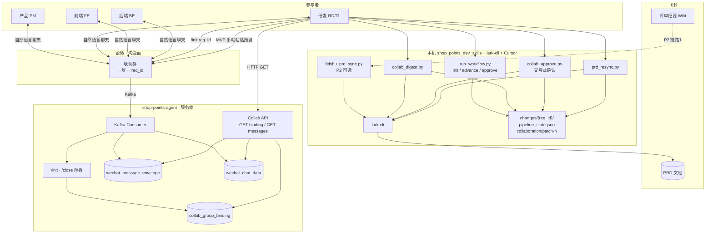

### 2.2 职责矩阵

| 能力 | Agent | Pipeline 本机 | 企微群 |
|------|:-----:|:-------------:|:------:|
| Kafka 消费 / 聊天落库 | ✅ | ❌ | 聊天 |
| 解析 `/init` `/close` | ✅ | ❌ | RD 发指令 |
| 解析 `/整理` `/确认` | ❌ | ❌ | ❌ |
| GET 绑群 / 拉消息 | ✅ | ✅ 调用 | ❌ |
| Webhook 发预览 | ❌ MVP | ❌ MVP | — |
| AI 凝练 + lark-cli | ❌ | ✅ | ❌ |
| patch 状态 | ❌ | ✅ 本地 | ❌ |
| `init` 生成 req_id | ❌ | ✅ | ❌ |
| prd_resync / workflow | ❌ | ✅ | ❌ |

### 2.3 Pull 模型（单向依赖）

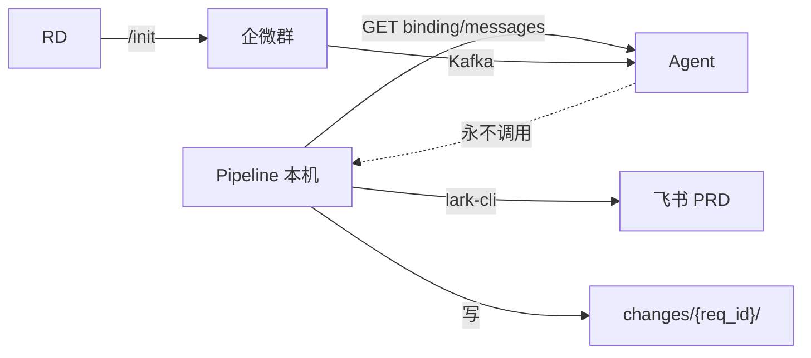

---

## 3. 核心流程

### 3.1 全链路阶段

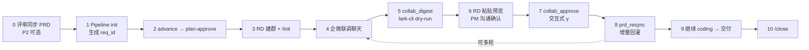

### 3.2 端到端时序

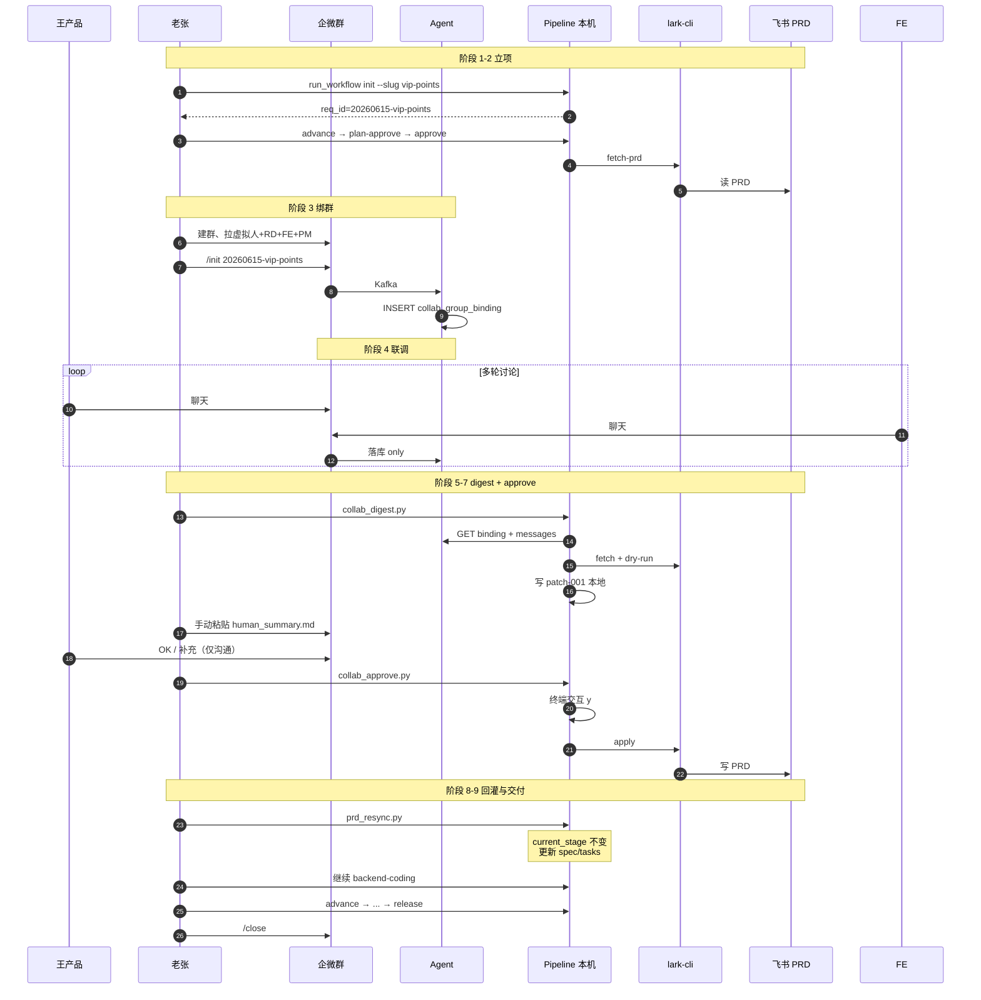

### 3.3 联调单轮闭环

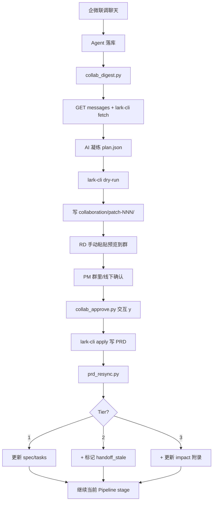

### 3.4 PM 确认（交互式 · 方式 A）

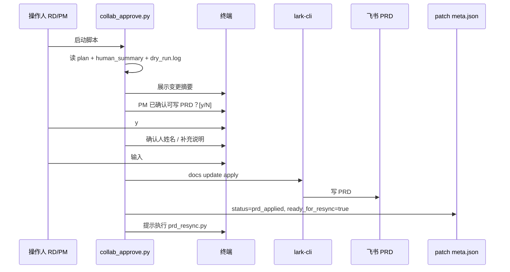

> **说明**：PM 在群里的「OK」仅作沟通，Pipeline **不 Pull 群消息**判定确认；写 PRD 的闸门在本机终端交互。

### 3.5 `/init` 绑群流程

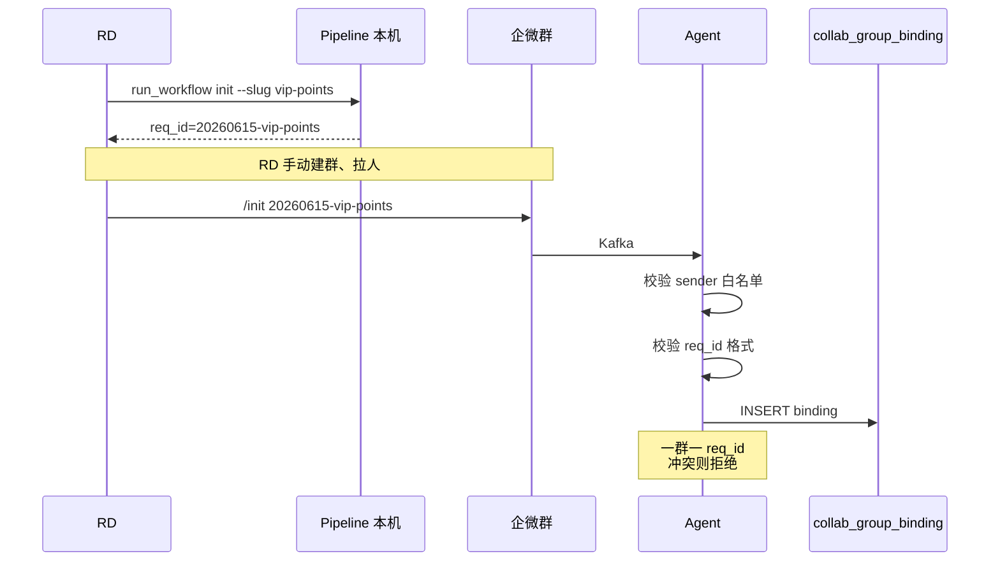

---

## 4. 数据设计

### 4.1 Agent 侧

#### collab_group_binding

```sql
CREATE TABLE collab_group_binding (
  req_id        VARCHAR(64)  PRIMARY KEY,
  group_id      VARCHAR(64)  NOT NULL UNIQUE,
  status        VARCHAR(16)  NOT NULL DEFAULT 'active',  -- active | closed
  init_by       VARCHAR(64),
  init_at       DATETIME     NOT NULL,
  closed_by     VARCHAR(64),
  closed_at     DATETIME,
  ctime         DATETIME     DEFAULT CURRENT_TIMESTAMP,
  mtime         DATETIME     DEFAULT CURRENT_TIMESTAMP ON UPDATE CURRENT_TIMESTAMP
);
```

#### 消息表（改造）

- 已有 `wechat_message_envelope`（含 `group_id`）
- 已有 `wechat_chat_data`（**建议新增 `group_id` 列**，便于按群查询）

```sql
ALTER TABLE wechat_chat_data ADD COLUMN group_id VARCHAR(64) DEFAULT '';
CREATE INDEX idx_chat_data_group_ctime ON wechat_chat_data(group_id, ctime);
```

**不建** `collab_patch` / `collab_event` 表。

### 4.2 Pipeline 本机侧

#### 目录结构

```text
changes/20260615-vip-points/
├── pipeline_state.json
├── request/
│   ├── prd.md
│   ├── spec.md
│   └── tasks.md
├── impact/impact.md
├── tech-design/tech-design.md
├── handoff/
└── collaboration/
    └── patch-001/
        ├── meta.json
        ├── plan.json
        ├── human_summary.md
        ├── dry_run.log
        └── digest_prompt.md      # 可选，Cursor 凝练用
```

#### patch meta.json

```json
{
  "patch_id": "patch-001",
  "seq": 1,
  "req_id": "20260615-vip-points",
  "window": "48h",
  "message_count": 42,
  "digest_at": "2026-06-15T08:30:00Z",
  "status": "draft | prd_applied | resync_done",
  "approver": "pm_wang",
  "approved_at": "2026-06-15T09:00:00Z",
  "approval_note": "4001 用「暂未开通会员」",
  "ready_for_resync": false
}
```

#### patch 状态机（本机）

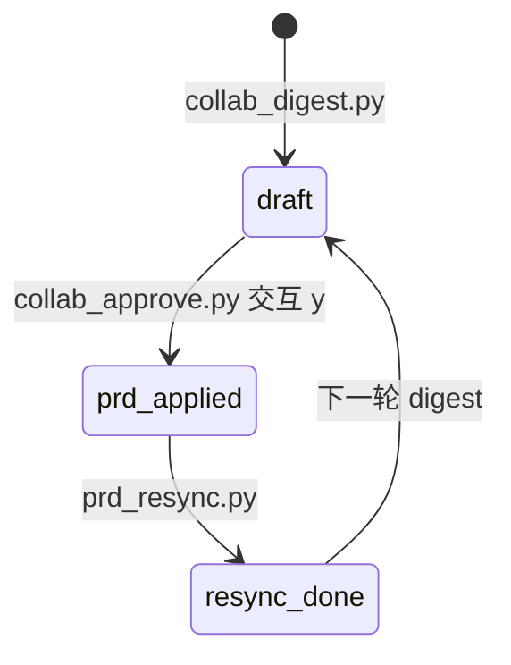

#### pipeline_state.json 扩展字段

```json
{
  "req_id": "20260615-vip-points",
  "slug": "vip-points",
  "collaboration": {
    "binding_status": "active",
    "group_id": "wr_abc123",
    "last_patch_seq": 1,
    "patches": {
      "patch-001": { "status": "resync_done" }
    }
  },
  "prd_resync": {
    "last_sync_at": "2026-06-15T09:15:00Z",
    "last_patch": "patch-001",
    "delta": {
      "tier": 1,
      "spec_updated": true,
      "tasks_updated": true,
      "handoff_stale": false
    }
  }
}
```

---

## 5. 接口设计

### 5.1 Agent HTTP API

```http
# 绑群查询
GET /api/v1/collab/bindings/{req_id}
→ { "req_id", "group_id", "status", "init_by", "init_at" }

GET /api/v1/collab/bindings/by-group/{group_id}

# 消息拉取（digest 用）
GET /api/v1/collab/messages?req_id={req_id}&since={ISO8601}&until={ISO8601}&limit=500
→ { "req_id", "group_id", "messages": [{ "msg_id", "sender_id", "sender_name", "content", "created_at" }] }
```

**MVP 无写接口、无 Webhook 接口。**

### 5.2 企微指令

| 指令 | 发送人 | Agent 行为 |
|------|--------|------------|
| `/init {req_id}` | RD/TL 白名单 | 写 `collab_group_binding` |
| `/close {req_id}` | RD/TL 白名单 | `status = closed` |

### 5.3 Pipeline CLI

```bash
# 立项
python run_workflow.py init \
  --url "https://beike.feishu.cn/wiki/prd-xxx" \
  --slug vip-points \
  --target /path/to/project

# 整理凝练
python collab_digest.py \
  --req-id 20260615-vip-points \
  --window 48h

# 交互式确认写 PRD
python collab_approve.py \
  --req-id 20260615-vip-points \
  --patch patch-001 \
  --approver pm_wang

# PRD 回灌
python prd_resync.py --req-id 20260615-vip-points
```

> **硬规则：真实 PRD 写回必须经 `collab_approve.py` 交互审批。**
>
> - `collab_digest.py` **只做 dry-run**，不会 apply。
> - `lark_cli.apply_prd()` 需存在 `approval.json` 且 plan 指纹一致。
> - 直接调用 `lark_cli.update(dry_run=False)` 会 `RuntimeError` 拒绝。
> - 开发联调时绕过 approve 直接调 lark-cli **不属于** Pipeline 正式路径。

**审批闸门流程：**

```
collab_digest（dry-run）→ PM 线下确认 → collab_approve（终端 y）→ approval.json → apply_prd → 飞书 PRD
```

---

## 6. PRD 回灌与 Pipeline 状态

### 6.1 定位

`prd_resync.py` 是**侧车脚本**，不是 `skills.json` 中的 stage；**默认不改变 `current_stage`**。

### 6.2 Tier 分级

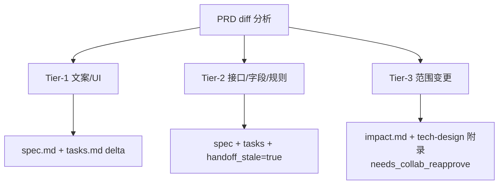

| Tier | 典型变更 | 更新范围 | Pipeline stage |
|------|----------|----------|----------------|
| 1 | 文案、空态、圆角 | spec + tasks | **不变**，继续 coding |
| 2 | 字段、错误码、业务规则 | + handoff 过期标记 | **不变**，需补跑 FDH |
| 3 | 新页面、新服务 | + impact + tech-design 附录 | **不变**，建议轻量复核 |

### 6.3 prd_resync 后进入哪个环节

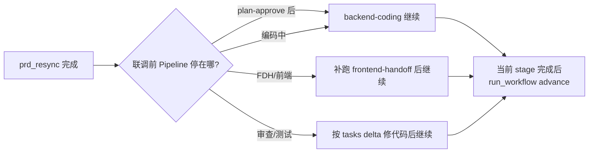

> **注意**：`prd_resync` 后**不要**立刻 `advance`，除非当前 stage 工作已完成。

---

## 7. Agent 改造要点

### 7.1 Kafka 消费分支

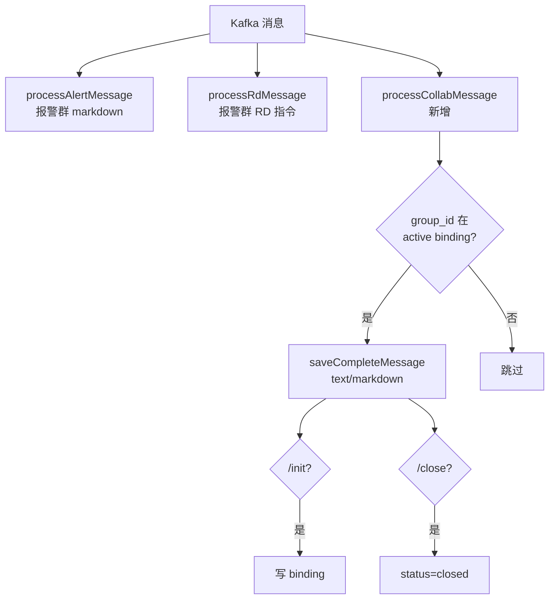

### 7.2 与报警逻辑隔离

- 新增 Apollo `collabConfig`，与 `alarmConfig` 分离
- 新增 `CollabCommandEnum`，与报警 `WechatCommandEnum` 分离
- 联调群 ID **不**写入报警 `groupId` 配置

### 7.3 文件清单

```text
shop-points-agent/
├── dao/domain/CollabGroupBinding.java          [新增]
├── dao/mapper/CollabGroupBindingMapper.java    [新增]
├── api/enums/CollabCommandEnum.java            [新增]
├── service/collab/CollabBindingService.java    [新增]
├── service/collab/CollabMessageQueryService.java [新增]
├── controller/CollabApiController.java         [新增]
└── service/mq/WechatInternalMsgConsumer.java  [改]
```

---

## 8. Pipeline 改造要点

### 8.1 init 改造

| 项 | 现状 | 目标 |
|----|------|------|
| 目录名 | `{date}-req-{slug}` | `{date}-{slug}[-n]` |
| branch | `feature/{slug}` | `feature/{req_id}` |
| 标识 | `name` | `req_id` 一等公民 |

### 8.2 脚本清单

```text
skills/req-to-dev/scripts/
├── run_workflow.py       [改]
├── collab_digest.py      [新增]
├── collab_approve.py     [新增]
├── prd_resync.py         [新增]
└── lib/
    ├── agent_client.py   [新增]
    └── lark_cli.py       [新增]

skills/req-to-dev/config/
└── agent.yaml.example  [新增]
```

### 8.3 lark-cli 封装（联调路径）

| 操作 | 用途 |
|------|------|
| `docs +fetch` | digest / resync 读 PRD |
| `docs +update --dry-run` | digest 预览 |
| `docs +update apply` | approve 写 PRD |

> 主 Pipeline `fetch-prd` 阶段暂仍可用 `feishu_fetcher.py`；联调路径统一 lark-cli。

---

## 9. 全链路 Demo（MVP）

**需求**：会员权益积分展示优化  
**req_id**：`20260615-vip-points`

| 步骤 | 执行人 | 动作 |
|------|--------|------|
| 1 | RD | `run_workflow init --slug vip-points` |
| 2 | RD | `advance` 至 `plan-approve` → `approve` |
| 3 | RD | 建群，拉人，发 `/init 20260615-vip-points` |
| 4 | 全员 | 企微联调聊天（Agent 落库） |
| 5 | RD | `collab_digest.py --window 48h` |
| 6 | RD | 复制 `human_summary.md` 粘贴到群 |
| 7 | PM | 群里 OK（仅沟通） |
| 8 | RD | `collab_approve.py` → 终端 `y` |
| 9 | RD | `prd_resync.py` |
| 10 | RD | 继续 `backend-coding`，完成后 `advance` |
| 11 | RD | … → release |
| 12 | RD | `/close 20260615-vip-points` |

---

## 10. 实施分期

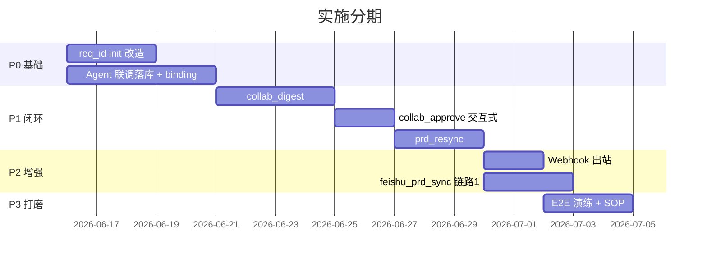

### PR 拆分建议

| PR | 内容 |
|----|------|
| PR-1 | `run_workflow` req_id + `pipeline_state` 字段 |
| PR-2 | Agent DB + `/init` + 联调落库 |
| PR-3 | Collab GET API |
| PR-4 | Pipeline `agent_client` + `lark_cli` 工具库 |
| PR-5 | `collab_digest` + `collab_approve` + `prd_resync` |

---

## 11. 待决策项（实施前确认）

| # | 项 | 选项 | 推荐 |
|---|-----|------|------|
| 4 | 联调群落库消息类型 | text only / text+markdown / +图片 | **text + markdown** |
| 5 | AI 凝练方式 | Cursor 手动 / 脚本调 LLM | **MVP：Cursor 手动** |
| 6 | Agent API 鉴权 | 裸 HTTP / Token | **Header Token** |
| 7 | 环境信息 | Agent URL、lark-cli 命令、init 白名单 sender_id | 实施前提供 |

---

## 12. 风险与缓解

| 风险 | 缓解 |
|------|------|
| 联调消息Currently 不落库（仅报警群） | 独立 `processCollabMessage` 分支 |
| lark-cli 本机环境差异 | `lark_cli.py` 封装 + dry-run 先验 |
| 人工确认遗漏 | 强制 TTY 交互 + pipeline.log 审计 |
| PRD resync 与编码并行 | Tier 分级 + handoff_stale 显式提示 |
| 旧 change 目录不兼容 | 旧项目继续用 legacy 命名，新项目用 req_id |

---

## 13. SOP 速查

```text
┌─────────────────────────────────────────────────────────────┐
│ 1. run_workflow init --slug          生成 req_id             │
│ 2. advance → plan-approve → approve  进入可联调阶段          │
│ 3. RD 建群 + /init {req_id}          Agent 绑群              │
│ 4. 企微联调聊天                        Agent 落库              │
│ 5. collab_digest.py                    lark-cli dry-run      │
│ 6. RD 手动粘贴预览到群                 MVP 无 Webhook        │
│ 7. PM 确认（仅沟通）                                           │
│ 8. collab_approve.py → y               写 PRD                 │
│ 9. prd_resync.py                       增量更新 spec/tasks    │
│10. 继续当前 stage 编码 → advance       交付                  │
│11. /close {req_id}                     解绑                   │
└─────────────────────────────────────────────────────────────┘
```

---

## 14. 一句话总结

> **Pipeline 本机 `init` 出 req_id 并跑 workflow；RD 建群发 `/init` 由 Agent 绑群；联调消息 Agent 只落库；digest/approve/resync 在本机用 lark-cli 完成；PM 确认靠交互式 `collab_approve`；patch 状态全在 `changes/{req_id}/collaboration/`；prd_resync 增量回灌且不改变 Pipeline stage。**

---

## 15. 实施状态（2026-06-22）

| 模块 | 状态 | 路径 |
|------|------|------|
| `run_workflow init --slug` | ✅ | `skills/req-to-dev/scripts/run_workflow.py` |
| Agent `/init` `/close` + 落库 | ✅ | `shop-points-agent/.../collab/*` |
| Collab GET API | ✅ | `CollabApiController.java` |
| DB 迁移 SQL | ✅ | `shop-points-agent/docs/sql/V001_collab_group_binding.sql` |
| `collab_digest.py` | ✅ | `skills/req-to-dev/scripts/` |
| `collab_approve.py` | ✅ | 交互式确认 |
| `prd_resync.py` | ✅ | Tier 增量回灌 |
| `collab-prd-sync` Skill | ✅ | `sub_skills/collab-prd-sync/SKILL.md` |
| `collab_prd_sync.py` 统一入口 | ✅ | digest / approve / resync / test |
| `feishu-doc-fetcher` → lark-cli | ✅ | fetch-prd 阶段已绑定 Skill |
| `feishu_prd_sync` 链路1 · 会议纪要 | ✅ | `meeting` 子命令 / `feishu_prd_sync.py` |
| Webhook 出站 | ⏸ MVP 未做 | P2 |

**Skill 触发（Cursor / Claude Code）**

| Skill | 示例说法 |
|-------|----------|
| `collab-prd-sync` | 「整理联调写回 PRD」→ digest；「根据会议纪要更新 PRD」→ meeting |
| `feishu-doc-fetcher` | 「获取飞书 PRD」「把飞书文档转 Markdown」 |

### 本地验证命令

```bash
# 0. 安装并配置 lark-cli（复用 feishu_fetcher 凭证）
bash skills/req-to-dev/scripts/setup_lark_cli.sh

# 1. lark-cli 连通性（collab-prd-sync Skill 入口）
python3 skills/req-to-dev/sub_skills/collab-prd-sync/scripts/collab_prd_sync.py test

# 2. 联调 digest / 会议纪要 meeting / approve / resync
python3 skills/req-to-dev/sub_skills/collab-prd-sync/scripts/collab_prd_sync.py digest --req-id <req_id>
python3 skills/req-to-dev/sub_skills/collab-prd-sync/scripts/collab_prd_sync.py meeting \
  --req-id <req_id> --meeting-url "https://beike.feishu.cn/wiki/xxx"
python3 skills/req-to-dev/sub_skills/collab-prd-sync/scripts/collab_prd_sync.py approve --req-id <req_id> --patch patch-001 --approver pm
python3 skills/req-to-dev/sub_skills/collab-prd-sync/scripts/collab_prd_sync.py resync --req-id <req_id>

# 2. 立项
python3 skills/req-to-dev/scripts/run_workflow.py init \
  --url "https://beike.feishu.cn/wiki/CKFdwt35oitbqPkU690cVMnln3g" \
  --slug lottery-wiki-test --target /Users/qidi/IdeaProjects/shop-points-lottery

# 3. Agent 部署后执行 SQL，Apollo 配置 collabConfig，联调群发 /init {req_id}
```

### lark-cli 配置说明

| 项 | 值 |
|----|-----|
| 安装 | `npm install -g @larksuite/cli` |
| 凭证 | 与 `~/.shop-points-dev-skills/feishu-config.json` 相同 app_id/app_secret |
| CLI 配置 | `~/.lark-cli/config.json` profile `shop-points-dev` |
| fetch | `lark-cli docs +fetch --doc <url> --doc-format markdown --format pretty` |
| update | `lark-cli docs +update --api-version v2 --command append ...` |

> **不降级 feishu_fetcher**：联调路径仅使用 lark-cli。

### Apollo collabConfig 示例

```json
{
  "enabled": true,
  "apiToken": "your-token",
  "initAllowedSenders": ["31449898"],
  "closeAllowedSenders": ["31449898"]
}
```

### Apollo 企微消费开关（alarmConfig + collabConfig）

`WechatInternalMsgConsumer` 将 **基础落库** 与 **报警分析 / 指令分析 / 联调处理** 解耦，各能力独立开关：

| 开关 | 配置项 | 默认 | 说明 |
|------|--------|------|------|
| Kafka 消费总开关 | `alarmConfig.enabled` | `true` | `false` 时整条消费者不处理 |
| 企微基础落库 | `alarmConfig.messagePersistEnabled` | `true` | 报警群 + 已绑定联调群的 text/markdown；**digest 依赖此项** |
| 报警 AI 分析 | `alarmConfig.alertAnalysisEnabled` | `true` | FAST markdown 报警 → RAG/CodeLink |
| RD 指令分析 | `alarmConfig.commandAnalysisEnabled` | `true` | `/跟进`、`/处理结论` 等 |
| 联调 /init /close | `collabConfig.enabled` | `true` | 群绑定与解绑；与 `alarmConfig` 分离 |

```json
{
  "enabled": true,
  "messagePersistEnabled": true,
  "alertAnalysisEnabled": true,
  "commandAnalysisEnabled": false,
  "groupId": "报警群ID",
  "...": "其他报警配置"
}
```

典型组合：

- **只开联调、关报警**：`alertAnalysisEnabled=false`, `commandAnalysisEnabled=false`, `messagePersistEnabled=true`, `collabConfig.enabled=true`
- **只开报警、暂不开联调**：`collabConfig.enabled=false`（落库仍覆盖报警群）
- **联调 digest 前**：务必 `messagePersistEnabled=true`，否则 API 拉不到群消息
