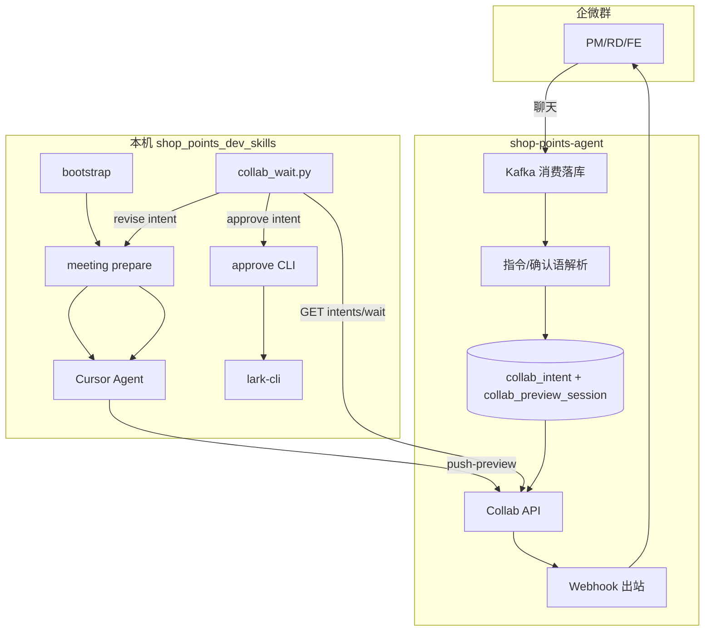
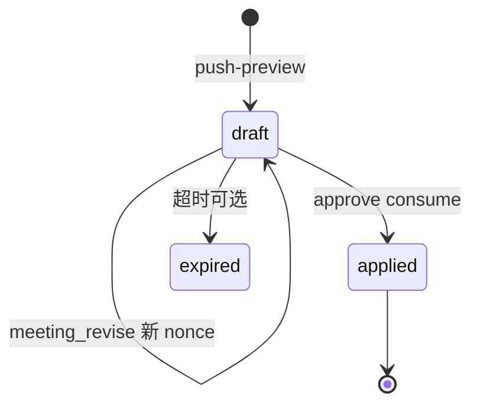
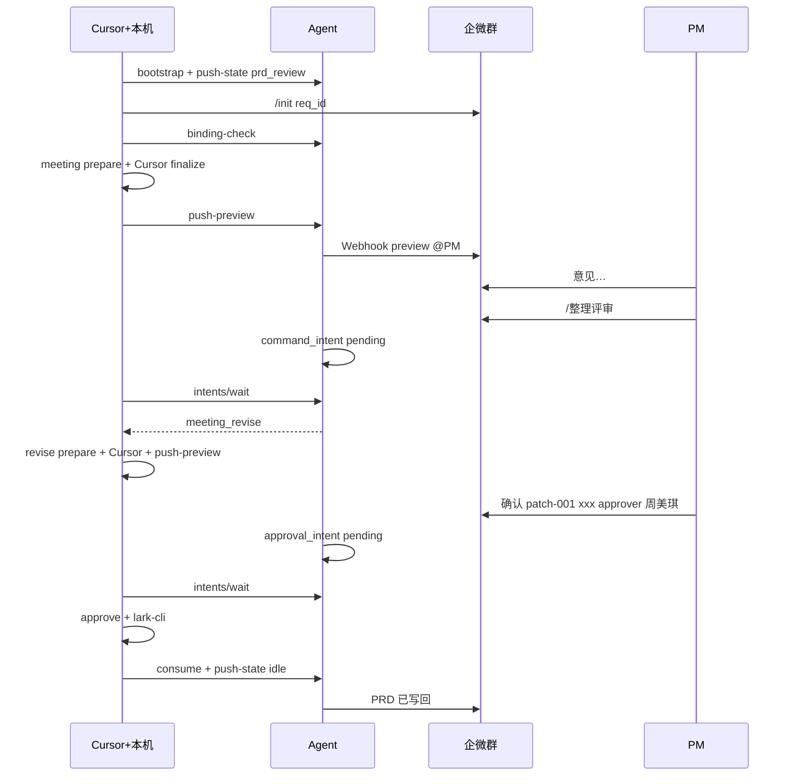

# 链路 1 · 评审纪要 → PRD 改造方案

> 版本：v0.2 · 2026-07-09  
> 范围：`shop_points_dev_skills`（Harness）+ `shop-points-agent`（Agent 服务端）  
> 状态：**已拍板，可实施**

---

## 1. 背景与目标

### 1.1 现状问题

| 问题 | 说明 |
|------|------|
| 双轨工作区 | 链路 1 用 `prd-sync/{prd_token}/`（无 req_id），Pipeline 用 `changes/{req_id}/`，绑群/patch 无法统一 |
| init 太晚 | `req_id` 在 `approve` 之后才 `init`，企微群 `/init` 无法覆盖评审期 |
| 入口过重 | 用户需记 slug/target；期望 **仅 PRD + 会议纪要两个链接** |
| 智能分叉复杂 | `meeting` 脚本启发式 / `agent_pending` 两路径，RD 心智负担大 |
| 协作未闭环 | 无 Webhook preview、无意图队列、无 `collab_wait`；PM 确认靠 Cursor 对话 |

### 1.2 改造目标

1. **输入**：仅飞书 PRD URL + 飞书会议纪要 URL +「整理会议纪要」
2. **req_id**：在第一步 **自动立项（bootstrap）** 时生成
3. **一群一 req_id**：评审 preview、修订、确认全程同一企微群
4. **智能在 Cursor**：脚本只做 **prepare（拉材料）**；摘要/plan/dry-run 由 **Cursor 一次性兜底**
5. **企微驱动**：preview 发群；`/整理评审`、确认语 → Agent 意图队列 → 本机 `collab_wait` 订阅执行
6. **不依赖 Python LLM 网关**：与当前代码方向一致（`llm_client.py` 已移除）

### 1.3 不在本方案范围

- 链路 2（联调 digest）详细改造（仅预留 `phase` / 时间窗字段）
- Agent 侧消息入库实时打标（**不做**；Pull + 时间窗即可）

---

## 2. 目标架构

### 2.1 模式：意图邮箱 + 阻塞 Pull



- **发布**：Agent 解析群消息后写 `collab_intent`（非广播，单消费者邮箱）
- **订阅**：本机 `collab_wait.py` 长轮询 `GET /intents/wait`，stdout 一行 JSON 唤醒 Cursor 主会话
- **写 PRD**：仅本机 `approve` + lark-cli（Cursor 对话确认降为备选）

### 2.2 工作区统一

**废弃**链路 1 独立 `prd-sync/{prd_token}/` 主路径（保留只读兼容一个版本）。

统一为：

```text
changes/{req_id}/
├── pipeline_state.json
├── request/prd.md                    # advance 后维护
└── collaboration/
    └── patch-001/
        ├── meeting.md                # 飞书纪要 fetch
        ├── prd_snapshot.md
        ├── messages_raw.md           # 修订轮：游标内群消息
        ├── meeting_prompt.md         # Cursor 任务说明（原 digest_prompt）
        ├── plan.json
        ├── human_summary.md
        ├── meta.json
        ├── dry_run.log
        └── approval.json             # approve 后
```

`meta.source = feishu_meeting`；`meta.revision_round` 从 1 递增。

### 2.3 pipeline_state 协作字段

```json
{
  "req_id": "20260709-vip-points",
  "trigger": {
    "type": "meeting",
    "url": "https://.../prd",
    "meeting_url": "https://.../meeting"
  },
  "target_path": null,
  "collaboration": {
    "phase": "prd_review",
    "group_id": "wr_abc123",
    "binding_status": "active",
    "prd_review": {
      "started_at": "2026-07-09T10:00:00Z",
      "ended_at": null,
      "active_patch": "patch-001",
      "revision_round": 1,
      "revision_cursor": "2026-07-09T10:00:00Z",
      "last_preview_at": null
    },
    "collab": {
      "started_at": null,
      "digest_cursor": null
    }
  }
}
```

| 字段 | 含义 |
|------|------|
| `phase` | `prd_review` → approve 后 `idle` → 首次 digest 后 `collab` |
| `revision_cursor` | 修订轮拉群消息起点（= 上一轮 `last_preview_at`） |
| `prd_review.ended_at` | 链路 1 结束；之后 `meeting-revise` 拒绝执行 |

---

## 3. 应用层时序（RD / PM / FE）

### 3.1 输入（仅两链接）

```text
整理会议纪要
PRD: https://beike.feishu.cn/wiki/prd-vip
纪要: https://beike.feishu.cn/wiki/meeting-0709
```

### 3.2 Cursor 编排（6 步对用户可见）

| 步 | 命令/动作 | 说明 |
|----|-----------|------|
| ① | `collab bootstrap` | 拉 PRD 标题 → slug → **生成 req_id**；`target` 可不填 |
| ② | 人工 + `/init {req_id}` | Cursor 输出 req_id，RD 建群绑机器人 |
| ③ | `binding-check` | GET binding，`status=active` 才继续 |
| ④ | `meeting prepare` + **Cursor 兜底** | prepare 只 fetch；Cursor 写 plan → finalize → push-preview |
| ⑤ | `collab_wait` | 阻塞等企微意图 |
| ⑥ | 循环 ④⑤ | `/整理评审` → revise prepare + Cursor；确认语 → approve |

### 3.3 角色分工

| 角色 | 企微 | Cursor |
|------|------|--------|
| RD | `/init`、可发 `/整理评审` | bootstrap、prepare、监听、advance（开发前补 target） |
| PM | 看 preview、意见、`确认 patch-… approver …` | 无 |
| FE | 评审意见 | 无 |

### 3.4 修订轮（合并 prepare + Cursor）

```text
群里 PM/RD/FE 讨论 → /整理评审
  → Agent: command_intent(meeting_revise)
  → collab_wait 唤醒
  → meeting-revise prepare（拉 since revision_cursor 群消息 + refetch 纪要/PRD）
  → Cursor 一次性：plan + finalize + push-preview（新 nonce）
```

**不**在入库时打标；修订轮群消息靠 `since=revision_cursor` + `until=prd_review.ended_at` 拉取。

---

## 4. Harness 改造（shop_points_dev_skills）

### 4.1 代码仓推断（拍板 2 · 已确认）

**不在 bootstrap 时向 RD 索要路径**。`bootstrap` 拉取 PRD 后，由 **Cursor 对照 PRD 正文 + knowledge** 写入 `pipeline_state.repos`（路径来自 `run_workflow.DEFAULT_REPOS`，与现网本机一致）：

| 角色 | 仓库 | 默认路径 | 判定依据（knowledge） |
|------|------|----------|------------------------|
| 后端 · 积分 | shop-points | `/Users/qidi/IdeaProjects/shop-points` | 门店积分/权益/发放/账户/星级等 → `knowledge/project-atlas.md` · shop-points |
| 后端 · 商城 | shop-points-lottery | `/Users/qidi/IdeaProjects/shop-points-lottery` | 积分商城/订单/抽奖/兑换/供应商 → shop-points-lottery |
| 前端 · H5 | store-integral-h5 | `/Users/qidi/IdeaProjects/store-integral-h5` | C 端/H5/员工端页面 |
| 前端 · 管理端 | store-integral | `/Users/qidi/IdeaProjects/store-integral` | PC 管理后台 |

**推断时机**：`bootstrap` 内嵌一步 **Cursor scope-hint**（读 `request/prd.md` 草稿 + `knowledge/project-atlas.md`），产出 `scope_hint.json`：

```json
{
  "project": "shop-points",
  "target_path": "/Users/qidi/IdeaProjects/shop-points",
  "frontend_scope": "partial",
  "mall_scope": "none",
  "surfaces": ["h5"],
  "deploy_modules": ["shop-points"],
  "inference_note": "PRD 涉及权益积分展示，无商城订单表述"
}
```

再调用现有 `_build_repos_state(target_path, …)` 写入 `pipeline_state.repos`。  
**advance 前**若 PRD 定稿后范围变化，在 `scope-eval` 阶段修正 impact frontmatter（与现 Pipeline 一致）；链路 1 调试期不要求自动 `advance`。

RD 仅在有歧义时手动覆盖：`bootstrap --target …` / `--project lottery`。

### 4.2 新增/改造 CLI

| 命令 | 文件 | 职责 |
|------|------|------|
| `collab bootstrap` | `scripts/collab_bootstrap.py` | 仅 PRD+纪要 URL；fetch 标题；**Cursor scope-hint 推断 repos**；`phase=prd_review` |
| `binding-check` | `scripts/collab_binding_check.py` | `AgentClient.get_binding`；写 `collaboration.group_id` |
| `meeting prepare` | 改 `feishu_prd_sync.py` 或新 `meeting_prepare.py` | 只 fetch + patch 骨架 + `meeting_prompt.md`；`plan_source=agent_pending` 固定 |
| `meeting-revise prepare` | 新 `meeting_revise_prepare.py` | 拉群消息 + refetch；写 `revise_prompt.md` |
| `finalize-plan` | 已有 | Cursor 写 plan 后重算 dry-run / human_summary |
| `push-preview` | `scripts/collab_push_preview.py` | POST Agent 注册 preview + 触发 Webhook |
| `collab_wait` | `scripts/collab_wait.py` | `GET /intents/wait`；stdout JSON |
| `push-state` | `scripts/collab_push_state.py` | POST Agent 同步 `phase` / 游标 |
| `approve` | 改 `collab_approve.py` | 支持 `--req-id` + `--pull-intent-id`；成功后 `prd_review.ended_at` + `push-state phase=idle` |

`collab_prd_sync.py` 子命令注册：`bootstrap | binding-check | meeting | meeting-revise | finalize-plan | push-preview | wait | approve`。

### 4.3 `auto_advance` 开关（拍板 3 · 已确认）

`secrets.local.json` 或 `agent.yaml`：

```json
{
  "collab": {
    "auto_advance_after_prd_approve": false
  }
}
```

| 值 | 行为 |
|----|------|
| `false`（**当前默认**） | 链路 1 `approve` 写飞书后仅 `push-state phase=idle` + 群通知；RD 显式「开始开发」再 `advance` |
| `true`（未来可开） | `approve` 成功后自动 `run_workflow advance`（需 `repos` 已推断） |

### 4.4 修订触发（拍板 4 · 已确认）

**仅企微群** `/整理评审`（或等价口令）写入 `command_intent`。  
**不**接受 Cursor 自然语言「整理评审反馈」作为生产触发（避免双入口）；RD 调试可在本机手动跑 `meeting-revise prepare` + Cursor，不走 Agent intent。

### 4.5 监听部署（拍板 5 · 已确认）

`collab_wait` **仅 RD 笔记本**运行（与 Cursor 同机）；合盖离线时 intent 在 Agent 队列 `pending`，上线后补消费。Mac mini Runner **暂不实施**。

### 4.6 废弃/降级

| 项 | 处理 |
|----|------|
| `prd-sync/{token}/` | 只读兼容 1 个版本；新需求走 `changes/{req_id}/` |
| `build_meeting_plan` 启发式 | 链路 1 默认不走；可保留供测试 |
| `approve --prd-url` 主路径 | 改为 `--req-id` 主路径 |
| `meeting` 后提示 `run_workflow init` | 删除（init 已前置） |

### 4.7 Cursor SKILL 改造

`sub_skills/collab-prd-sync/SKILL.md` 链路 1 固定清单：

```text
1. bootstrap（两链接）
2. 若未绑群 → 输出 req_id + /init 指引 → 等「绑群完成」
3. binding-check
4. meeting prepare
5. 读 patch-NNN/meeting_prompt.md + 材料 → 写 plan.json → finalize-plan → push-preview
6. Shell: collab_wait.py --timeout 600
7. 收到 meeting_revise intent → meeting-revise prepare → 重复 5
8. 收到 approval_intent → approve --pull-intent-id（禁止手填 chat-confirm）
```

`.cursor/rules/collab-prd-sync.mdc` 同步更新触发词与步骤。

### 4.8 agent_client.py 扩展

```python
def push_state(self, req_id: str, body: dict) -> dict: ...
def push_preview(self, req_id: str, patch_id: str, body: dict) -> dict: ...
def wait_intents(self, req_id: str, timeout_sec: int = 55) -> list[dict]: ...
def consume_intent(self, intent_id: str) -> dict: ...
```

### 4.9 bootstrap 细节

```bash
python3 collab_prd_sync.py bootstrap \
  --prd-url "https://..." \
  --meeting-url "https://..." \
  [--slug vip-points]   # 拍板1-B：可选覆盖自动 slug
```

1. `lark-cli fetch` PRD → 解析标题 → `slugify(title)` → `req_id = {YYYYMMDD}-{slug}[-n]`（拍板 **1-B**：可用 `--slug` 覆盖）
2. 创建 `changes/{req_id}/`（`collaboration/` 等子目录）
3. **Cursor scope-hint**：PRD + `knowledge/project-atlas.md` → `scope_hint.json` → 写入 `target_path` / `repos` / `project`（拍板 **2**，见 §4.1）
4. `pipeline_state.json`：`trigger.url`、`trigger.meeting_url`、`collaboration.phase=prd_review`
5. `collab push-state` → Agent

---

## 5. Agent 改造（shop-points-agent）

项目路径：`/Users/qidi/IdeaProjects/shop-points-agent`

### 5.1 现有能力（复用）

| 模块 | 路径 |
|------|------|
| Collab API | `.../controller/CollabApiController.java` |
| 绑群 | `.../service/collab/CollabBindingService.java` |
| 消息查询 | `.../service/collab/CollabMessageQueryService.java` |
| Kafka + /init /close | `.../service/collab/CollabMessageHandler.java` |
| 消息落库 | `.../service/mq/WechatMessagePersistService.java` |
| 企微机器人 | `.../service/im/WeiXinWorkRobotService.java`（现仅报警） |

### 5.2 新增表（遵循现有规范）

与 `collab_group_binding` 一致：

- Java：`shop-points-agent-dao/.../dao/domain/*.java`（Lombok `@Builder`、`LocalDateTime ctime/mtime`）
- Mapper XML：`ctime`/`mtime` 使用 `LocalDateTimeTypeHandler`
- 业务时间字段用 `*_at`（如 `consumed_at`）；表级审计用 **`ctime` / `mtime`**

#### `collab_preview_session`

```sql
CREATE TABLE collab_preview_session (
  req_id          VARCHAR(64)  NOT NULL,
  patch_id        VARCHAR(32)  NOT NULL,
  group_id        VARCHAR(64)  NOT NULL,
  nonce           VARCHAR(16)  NOT NULL,
  status          VARCHAR(16)  NOT NULL DEFAULT 'draft',  -- draft | applied | expired
  revision_round  INT          NOT NULL DEFAULT 1,
  summary_excerpt TEXT,
  expires_at      DATETIME     NULL,
  ctime           DATETIME     NOT NULL DEFAULT CURRENT_TIMESTAMP,
  mtime           DATETIME     NOT NULL DEFAULT CURRENT_TIMESTAMP ON UPDATE CURRENT_TIMESTAMP,
  PRIMARY KEY (req_id, patch_id)
) ENGINE=InnoDB DEFAULT CHARSET=utf8mb4 COMMENT='PRD preview 会话（patch+nonce）';
```

#### `collab_intent`

```sql
CREATE TABLE collab_intent (
  id              BIGINT       NOT NULL AUTO_INCREMENT,
  req_id          VARCHAR(64)  NOT NULL,
  patch_id        VARCHAR(32)  NULL,
  intent_type     VARCHAR(32)  NOT NULL,  -- command_intent | approval_intent
  action          VARCHAR(32)  NOT NULL,  -- meeting_revise | approve
  payload_json    TEXT         NOT NULL,
  status          VARCHAR(16)  NOT NULL DEFAULT 'pending',  -- pending | consumed | rejected
  reject_reason   VARCHAR(256) NULL,
  consumed_at     DATETIME     NULL,
  ctime           DATETIME     NOT NULL DEFAULT CURRENT_TIMESTAMP,
  mtime           DATETIME     NOT NULL DEFAULT CURRENT_TIMESTAMP ON UPDATE CURRENT_TIMESTAMP,
  PRIMARY KEY (id),
  INDEX idx_intent_pending (req_id, status, ctime)
) ENGINE=InnoDB DEFAULT CHARSET=utf8mb4 COMMENT='企微协作意图队列';
```

#### `collab_req_state`

```sql
CREATE TABLE collab_req_state (
  req_id              VARCHAR(64)  NOT NULL,
  phase               VARCHAR(16)  NOT NULL DEFAULT 'prd_review',
  revision_cursor     VARCHAR(32)  NULL,
  prd_review_ended_at VARCHAR(32)  NULL,
  collab_started_at   VARCHAR(32)  NULL,
  state_json          TEXT         NULL,
  ctime               DATETIME     NOT NULL DEFAULT CURRENT_TIMESTAMP,
  mtime               DATETIME     NOT NULL DEFAULT CURRENT_TIMESTAMP ON UPDATE CURRENT_TIMESTAMP,
  PRIMARY KEY (req_id)
) ENGINE=InnoDB DEFAULT CHARSET=utf8mb4 COMMENT='Harness 协作阶段镜像（非消息打标）';
```

SQL 文件：`shop-points-agent/docs/sql/V002_collab_intent.sql`（与 `CollabGroupBinding` 同目录约定）。

### 5.3 群消息解析（规则，不用 LLM）

在 `CollabMessageHandler` 或新 `CollabIntentParser` 中，**已绑群**且落库后：

| 消息模式 | intent |
|----------|--------|
| `/整理评审` 或 `整理评审反馈` | `command_intent` / `meeting_revise` |
| `确认 patch-(\d+) ([a-f0-9]+) approver (\S+)` | `approval_intent` / `approve` |
| `/init`、`/close` | 现有逻辑 |
| 其他 | 仅落库，不产生 intent |

**校验**（读 `collab_req_state`，无则默认 `prd_review`）：

| action | 条件 |
|--------|------|
| `meeting_revise` | `phase == prd_review` 且 `prd_review_ended_at` 为空 |
| `approve` | 存在 active `collab_preview_session`；nonce/patch 匹配；sender ∈ PM 白名单（`collabConfig.pmAllowedSenders` 或复用文档约定） |

校验失败：可选群回复「当前阶段不允许此操作」。

### 5.4 新增 HTTP API

```http
POST /api/v1/collab/push-state
Body: { "req_id", "phase", "revision_cursor", "prd_review_ended_at", "collab": {...} }

POST /api/v1/collab/preview-sessions
Body: { "req_id", "patch_id", "group_id", "nonce", "revision_round", "summary_excerpt" }

POST /api/v1/collab/notify
Body: { "req_id", "group_id", "mentions": [], "markdown": "..." }

GET  /api/v1/collab/intents/wait?req_id=&timeout_sec=55
→ 阻塞至有 pending intent 或超时；返回 JSON 数组

POST /api/v1/collab/intents/{id}/consume
→ 标记 consumed（本机 approve 成功后调用）
```

鉴权：沿用 `X-Collab-Token`。

### 5.5 Webhook 出站

- Apollo `collabConfig.webhookUrl`（与 `alarmConfig.robotKeyUrl` 分离）
- **联调/评审群机器人（已拍板）**：

```text
https://qyapi.weixin.qq.com/cgi-bin/webhook/send?key=e2dd97d9-be1f-49e5-85ff-5deb7431bac4
```

- `CollabNotifyService` 封装 markdown @（mentions 用 sender_id）
- `push-preview` 调用 `POST /notify` 发送 preview 模板

> 安全提示：生产环境 webhook key 建议放 Apollo 配置中心，勿提交到 git 明文。

### 5.6 /init 成功回群（体验优化）

`bindInit` 成功后向该群发：

```text
✅ 已绑定 req_id=20260709-vip-points
评审 preview 将发本群；确认语格式见后续机器人消息
```

### 5.7 文件清单（Agent）

```text
shop-points-agent/
├── dao/domain/CollabIntent.java              [新增]
├── dao/domain/CollabPreviewSession.java      [新增]
├── dao/domain/CollabReqState.java            [新增]
├── dao/mapper/*Mapper.java + xml             [新增]
├── service/collab/CollabIntentService.java   [新增]
├── service/collab/CollabIntentParser.java    [新增]
├── service/collab/CollabNotifyService.java   [新增]
├── service/collab/CollabReqStateService.java [新增]
├── controller/CollabApiController.java       [改 POST/GET]
├── service/collab/CollabMessageHandler.java  [改 解析意图]
└── docs/sql/V002_collab_intent.sql           [新增]
```

---

## 6. 意图与 preview 状态机





---

## 7. 实施分期与 PR 拆分

### P0 · 工作区与立项（Harness only，1–2d）

| PR | 内容 |
|----|------|
| H-1 | `collab bootstrap`；`changes/{req_id}` 协作字段；废弃新需求走 prd-sync |
| H-2 | `meeting prepare`（薄 fetch）；SKILL 改为 Cursor 兜底单路径 |
| H-3 | `binding-check`；`finalize-plan --req-id` 统一 |

**验收**：两链接 → req_id → 本地 patch + Cursor 可完成 dry-run（仍手动确认 approve）。

### P1 · Agent phase + preview 出站（2–3d）

| PR | 内容 |
|----|------|
| A-1 | `collab_req_state` + `POST /push-state` |
| A-2 | `collab_preview_session` + `POST /preview-sessions` + `POST /notify` |
| H-4 | `collab_push_preview.py` + `collab_push_state.py` |

**验收**：prepare + Cursor 后，群里收到 Webhook preview。

### P2 · 意图队列 + 监听（2–3d）

| PR | 内容 |
|----|------|
| A-3 | `collab_intent` + 群消息解析 + phase 校验 |
| A-4 | `GET /intents/wait` + `POST /intents/{id}/consume` |
| H-5 | `collab_wait.py`；`approve --pull-intent-id` |
| H-6 | SKILL 增加 wait 循环 |

**验收**：PM 确认语 → 本机自动 approve；无需 Cursor 打字确认。

### P3 · 修订轮（2d）

| PR | 内容 |
|----|------|
| H-7 | `meeting-revise prepare` + 游标更新 |
| A-5 | `/整理评审` 解析 + `meeting_revise` 校验 |
| H-8 | SKILL wait 分支处理 revise |

**验收**：群里多轮意见 → `/整理评审` → 新 preview → 再确认写 PRD。

### P4 · 打磨（1d）

- `/init` 回群文案；intent 校验失败提示
- `docs/联调协作方案.md` 与 v0.6 汇报勘误（去除 LLM 网关表述）
- E2E SOP 演练

---

## 8. 风险与缓解

| 风险 | 缓解 |
|------|------|
| 本机离线时 intent 堆积 | `pending` 保留；开机后 `collab_wait` 补消费 |
| 确认语误触 | 严格正则 + nonce + PM 白名单 |
| 评审/联调消息混淆 | `revision_cursor` + `prd_review.ended_at`；链路 2 另案 `collab_started_at` |
| `prd-sync` 旧 patch | 只读兼容；新需求强制 bootstrap |
| Webhook 与报警机器人混用 | 独立 `collabConfig.webhookUrl` |

---

## 9. 配置示例

### Harness `secrets.local.json`

```json
{
  "agent": {
    "base_url": "http://shop-points-agent.shop-points-test01.ttb.test.ke.com",
    "token": "..."
  },
  "collab": {
    "auto_advance_after_prd_approve": false,
    "sender_roles": {
      "29198147": "PM",
      "31449898": "RD",
      "31175736": "FE"
    }
  }
}
```

### Agent Apollo `collabConfig` 扩展

```json
{
  "enabled": true,
  "apiToken": "...",
  "initAllowedSenders": ["31449898"],
  "closeAllowedSenders": ["31449898"],
  "pmAllowedSenders": ["29198147"],
  "webhookUrl": "https://qyapi.weixin.qq.com/cgi-bin/webhook/send?key=e2dd97d9-be1f-49e5-85ff-5deb7431bac4"
}
```

---

## 10. 一句话总结

> **链路 1 改造 = 两链接 bootstrap 即得 req_id + 一群绑定 + meeting prepare（脚本只拉数）+ Cursor 写 plan + push-preview 发群 + Agent 意图队列 + collab_wait 自动 approve；废弃 prd-sync 双轨与脚本侧 LLM/启发式分叉。**

---

## 11. 已拍板决策（2026-07-09）

| # | 项 | 决策 |
|---|-----|------|
| 1 | slug / req_id | **B**：PRD 标题自动 slug；允许 `--slug` 覆盖 |
| 2 | 代码仓 | **bootstrap 时 Cursor + knowledge 推断** `project` / `repos` / `target_path`（路径见 §4.1）；歧义时 RD 可手动覆盖 |
| 3 | approve 后 advance | **开关** `auto_advance_after_prd_approve`，**当前 `false`**（链路 1 调试期） |
| 4 | 修订触发 | **A**：仅企微 `/整理评审` → `command_intent`（生产路径） |
| 5 | collab_wait | **A**：仅 RD 笔记本，与 Cursor 同机 |
| 6 | Agent 建表 | 必须含 **`ctime` / `mtime`**，对齐 `collab_group_binding` |
| 7 | Webhook | 使用已提供联调群机器人 URL（见 §5.5 / §9） |
