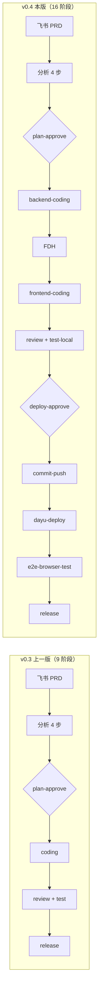
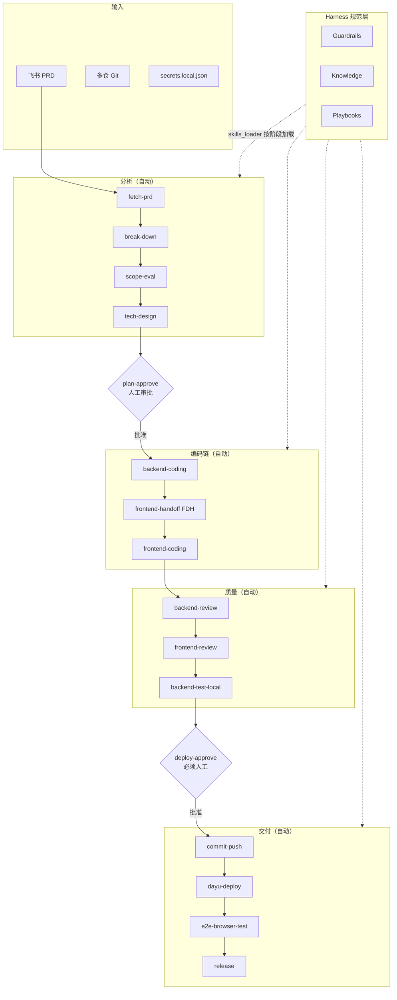
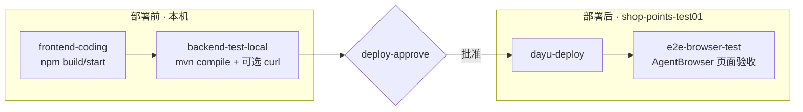
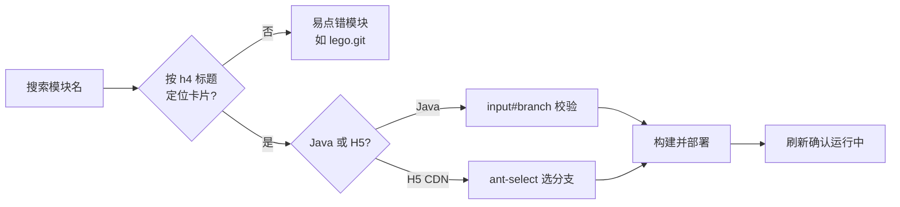
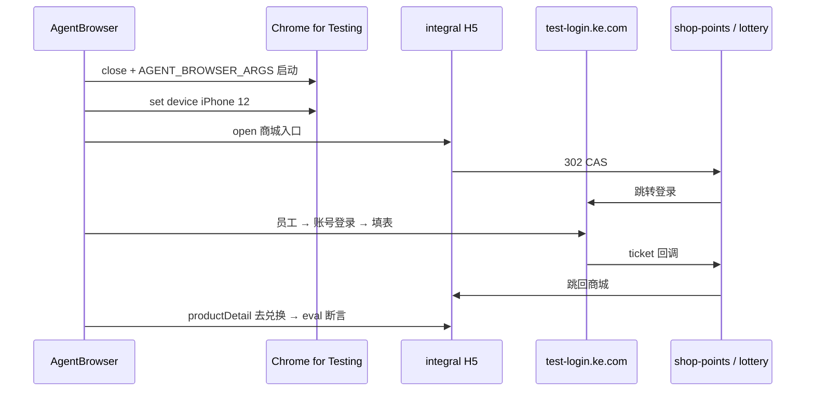
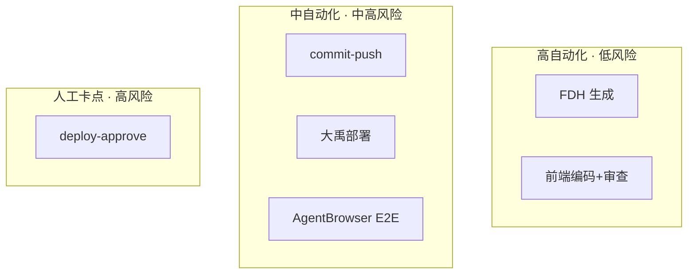
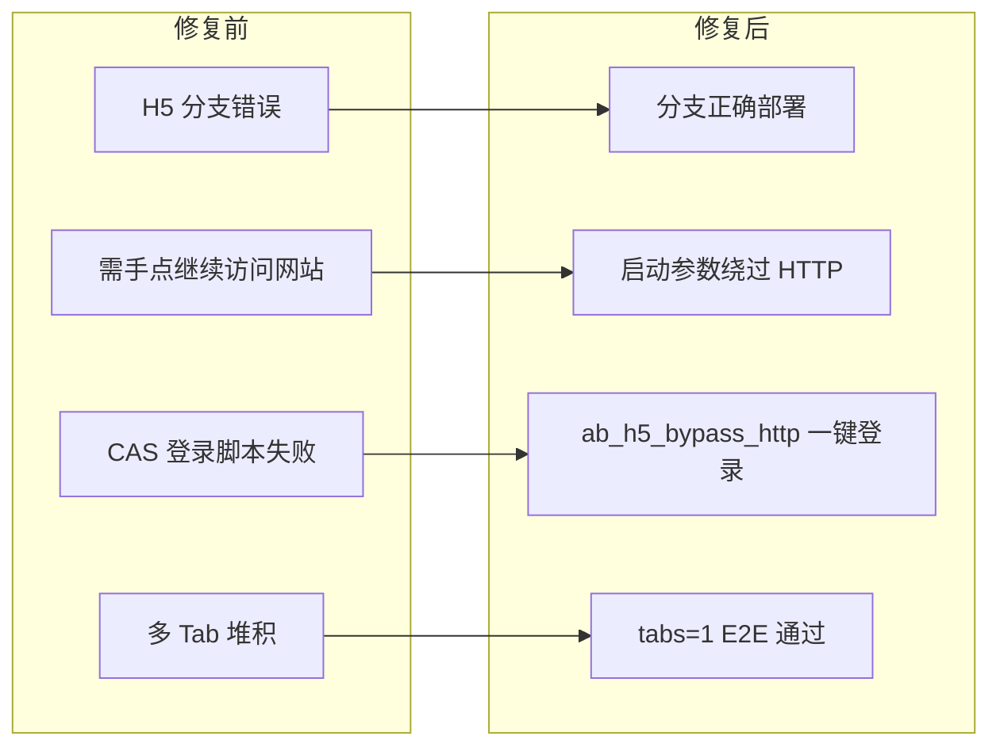

# 门店积分团队 Agentic Coding 全栈改造汇报（v0.4）

**团队**：门店积分研发组

**时间**：2026 年 6 月

**范围**：shop_points_dev_skills Harness 工具集 + shop-points-lottery / H5 全栈需求验证

**上一版汇报**：门店积分Agentic Coding实践汇报（2026 年 5 月，v0.3，9 阶段后端 Pipeline）

**本版定位**：从「后端需求 → 编码 → 本地测」升级为「全栈需求 → 多仓编码 → 测试环境部署 → AgentBrowser E2E」端到端 Harness

## 一、与上一版的核心差异

| 维度 | 上一版 v0.3 | 本版 v0.4（未 Commit） |
| --- | --- | --- |
| Pipeline 阶段 | 9 阶段 | 16 阶段 |
| 人工审批点 | 1 个 plan-approve | 2 个 plan-approve + deploy-approve |
| 覆盖范围 | 后端 Java 为主 | 后端 + 前端 PC/H5 + 部署 + E2E |
| 前端协作 | 无 | FDH 强制交接 |
| 多仓 Git | 单后端仓 | 最多 4 仓 |
| 测试环境 | 本地 curl / 启动应用 | 大禹部署 + AgentBrowser E2E |
| Playbooks | 6 个 | 13 个 |
| Knowledge | 10 个 | 13 个 |
| skills.json 版本 | 无 | 0.4.0 |
| 浏览器工具 | 无 | agent-browser CLI |

### 1.1 版本演进流程图



## 二、改造总览：16 阶段全栈 Pipeline

### 2.1 新 Pipeline 全流程图



### 2.2 验证分层：本地测 vs 测试环境 E2E



说明：当前无独立 frontend-test-local 阶段；前端本地 build 在 frontend-coding，页面 E2E 在 e2e-browser-test。

### 2.3 流程说明（文字版）

**输入**：

- 飞书 PRD
- 多仓 Git（backend + PC + H5）
- secrets.local.json 凭证

**分析阶段（自动）**：fetch-prd → break-down → scope-eval → tech-design

**审批 1（人工阻塞）**：plan-approve

**编码链（自动）**：backend-coding → frontend-handoff（FDH）→ frontend-coding

**质量阶段（自动）**：backend-review → frontend-review → backend-test-local

**审批 2（人工阻塞，必须）**：deploy-approve

**交付阶段（自动）**：commit-push → dayu-deploy → e2e-browser-test → release

**Harness 规范层（全程按需加载）**：Guardrails + Knowledge + Playbooks，由 skills_loader 按阶段注入，不一次性塞满上下文。

### 2.4 关键设计决策（相对上一版新增）

| 决策 | 说明 | 沉淀位置 |
| --- | --- | --- |
| FDH 紧接后端编码 | 前端交接基于真实后端 diff，不是技术方案复印件 | runtime/pipeline.md、frontend-handoff.md |
| deploy-approve 必须人工 | push 与部署测试环境前强制人工看 diff | skills.json、recovery.md |
| 条件跳过 | frontend_scope 为 none 时跳过 FDH/前端/E2E | run_workflow.py |
| 多仓状态 | init 记录 backend + PC/H5 路径与分支 | run_workflow.py |
| AgentBrowser 专用 Session | 大禹与 H5 E2E 分 Session，避免 Tab/Cookie 污染 | e2e-browser-test.md |

## 三、分项改造点（未 Commit 全量）

### 3.1 Pipeline 与编排层

| 文件 | 改造内容 |
| --- | --- |
| skills.json | v0.4.0；16 阶段；skip_when；新增 7 playbook + 3 knowledge |
| runtime/pipeline.md | 9→16 阶段；编码链说明；部署顺序 |
| runtime/recovery.md | 前端/部署/E2E 失败恢复；双审批驳回 |
| run_workflow.py | 多仓 init；impact 解析；阶段跳过 |
| skills/req-to-dev/SKILL.md | 全栈执行指令；Step 0 多仓 Git |
| CLAUDE.md | 目录与 Pipeline 同步 16 阶段 |

### 3.2 新增 Playbooks（7 个）

| Playbook | 阶段 | 作用 |
| --- | --- | --- |
| git-branch-init.md | Step 0 | 多仓 feature 分支规范 |
| frontend-handoff.md | frontend-handoff | FDH + api-contract + E2E 模板 |
| frontend-coding.md | frontend-coding | 按 FDH 改 PC/H5 |
| frontend-review-checklist.md | frontend-review | 前端审查清单 |
| commit-push.md | commit-push | 多仓 commit/push 报告 |
| dayu-deploy.md | dayu-deploy | 大禹部署 SOP |
| e2e-browser-test.md | e2e-browser-test | AgentBrowser E2E SOP |

### 3.3 新增 Knowledge（3 个）

| 文档 | 作用 |
| --- | --- |
| frontend-atlas.md | PC/H5 仓库结构与构建命令 |
| dayu-platform.md | 大禹环境与模块部署要点 |
| test-env-topology.md | 测试环境 URL 与 CAS 链路 |

### 3.4 配置与脚本

| 文件 | 作用 |
| --- | --- |
| secrets.local.json.example | 大禹/测试环境/飞书凭证模板 |
| fdh-template.md | FDH 文档模板 |
| ab_h5_bypass_http.py | H5 一键登录（手机模式+CAS+HTTP 绕过） |

### 3.5 既有 Playbook 修订

| 文件 | 变更 |
| --- | --- |
| scope-evaluation.md | 增加 frontend_scope / deploy_modules 等 frontmatter |
| test-authoring.md | 与全栈验证路径对齐 |
| .gitignore | 忽略 secrets、changes 等运行时产物 |

## 四、真实案例：lottery-wiki-ckfd

**需求**：混合支付商品，服务基金余额为 0 时 H5 展示红字，且不展示「服务基金支付」。

**Change**：changes/20260609-req-lottery-wiki-ckfd

**分支**：feature/lottery-wiki-ckfd

### 4.1 阶段执行情况

| 阶段 | 结果 | 关键产出 |
| --- | --- | --- |
| 分析 + plan-approve | 通过 | spec / impact / tech-design |
| backend-coding | 通过 | ShopOrderBizService 混合支付分支 |
| frontend-handoff | 通过 | frontend-handoff.md + api-contract.yaml |
| frontend-coding | 通过 | H5 支付提示 UI |
| review + backend-test-local | 通过 | 审查报告 + 接口验证 |
| deploy-approve | 人工通过 | 无 |
| commit-push | 通过 | 多仓 push |
| dayu-deploy | 通过（修复后） | dayu_deploy_report.md |
| e2e-browser-test | E2E-01 通过 / E2E-02 跳过 | e2e_test_report.md |
| release | 通过 | deploy/verify.md |

### 4.2 E2E 结论（AgentBrowser，2026-06-09）

| 用例 | 状态 | 断言 |
| --- | --- | --- |
| E2E-01 | 通过 | 红字 #ff4d4f；无服务基金支付；仅权益积分支付 |
| E2E-02 | 跳过 | 门店 TJDY0101 服务基金为 0，不满足 serv>0 前置 |

## 五、踩坑与解决

### 5.1 大禹部署



| 编号 | 坑 | 现象 | 解决 | 效果 |
| --- | --- | --- | --- | --- |
| D1 | H5 分支选错 | h5-cdn 停在旧联调分支 | h4 定位 + ant-select 选 feature 分支 | 本需求代码生效 |
| D2 | 模块索引漂移 | 点到错误构建部署 | 搜索 + heading 锚定卡片 | 避免误部署 |
| D3 | Java/H5 弹窗不同 | H5 找不到 input#branch | playbook 区分两种弹窗 | 自动化可复现 |

### 5.2 AgentBrowser H5 登录与 HTTP 拦截



| 编号 | 坑 | 现象 | 解决 | 效果 |
| --- | --- | --- | --- | --- |
| E1 | HTTP 不安全连接 | 需手点「继续访问网站」 | close 后带 AGENT_BROWSER_ARGS 启动 | 无需手点 |
| E2 | 拦截页不在 DOM | find click 无效 | 启动参数预防，不靠点按钮 | 边界清晰 |
| E3 | CAS 加载中 | networkidle 后点员工失败 | wait_cas_ready 等 SPA 就绪 | 登录稳定 |
| E4 | URL hash 误判 | 选完员工仍判失败 | 用页面文案判断，不用 #/select-as | 流程不卡 |
| E5 | 未切手机模式 | PC 版 CAS UI | set device iPhone 12 后再 open | 与线上一致 |
| E6 | 多 Tab 堆积 | 登录后 3～4 个 Tab | close_extra_tabs 只留 integral | tabs=1 |
| E7 | Session 混用 | 大禹 Tab 干扰 E2E | 大禹与 H5 用不同 SESSION_NAME | 状态隔离 |

**HTTP 放行参数（须在 close 后启动时注入）**：

```
export AGENT_BROWSER_ARGS="--unsafely-treat-insecure-origin-as-secure=http://integral.ttb.test.ke.com,http://shop-points-lottery.shop-points-test01.ttb.test.ke.com,http://shop-points-lottery.shop-points-test01.ttb.test.ke.com:80,http://shop-points.shop-points-test01.ttb.test.ke.com,http://shop-points.shop-points-test01.ttb.test.ke.com:80,--disable-features=HttpsFirstMode,HttpsUpgrades,HttpsFirstBalancedMode,--disable-web-security,--allow-running-insecure-content,--ignore-certificate-errors,--test-type,--remote-allow-origins=*"
```

**一键登录**：

```
export AGENT_BROWSER_SESSION_NAME="req-to-dev-<change-name>-h5"
python3 skills/req-to-dev/scripts/ab_h5_bypass_http.py
```

### 5.3 全栈协作

| 编号 | 坑 | 解决 | 沉淀 |
| --- | --- | --- | --- |
| F1 | 前端不知最终 API | FDH 基于后端 diff | frontend-handoff.md |
| F2 | 纯后端不应走前端 | frontend_scope:none 自动跳过 | scope-evaluation.md |
| F3 | 部署前未人工确认 | 新增 deploy-approve | skills.json |

## 六、Harness 复利沉淀

| 本次踩坑 | 沉到哪一层 | 沉淀物 |
| --- | --- | --- |
| H5 ant-select 与 Java 不同 | 执行编排 + Playbook | dayu-deploy.md |
| HTTP/CAS 测试环境 | Knowledge | test-env-topology.md |
| AgentBrowser 不能点原生 UI | 工具脚本 | ab_h5_bypass_http.py |
| CAS 加载时序 | 脚本 | wait_cas_ready |
| 前端仓库不清 | Knowledge | frontend-atlas.md |
| 多仓分支混乱 | Playbook | git-branch-init.md |

## 七、交付物统计对比

| 类别 | v0.3 | v0.4 |
| --- | --- | --- |
| Pipeline 阶段 | 9 | 16 |
| 人工审批点 | 1 | 2 |
| Guardrails | 4 | 4 |
| Knowledge | 10 | 13 |
| Playbooks | 6 | 13 |
| 自动化脚本 | 2 | 3 |
| 凭证模板 | 无 | secrets.local.json.example |
| FDH 模板 | 无 | fdh-template.md |

**本改造新增文件（节选）**：

- knowledge：dayu-platform.md、frontend-atlas.md、test-env-topology.md
- playbooks：git-branch-init、frontend-handoff、frontend-coding、frontend-review、commit-push、dayu-deploy、e2e-browser-test
- scripts：ab_h5_bypass_http.py

**本改造核心修改**：

- skills.json、SKILL.md、run_workflow.py、runtime/pipeline.md、runtime/recovery.md

## 八、与上一版衔接结论

**上一版结论（仍然成立）**：req-to-dev 是流程入口；Guardrails/Knowledge/Playbooks 是工程规范层；Pipeline 实现按需加载；Domain Spec 是提效前提。

**本版新问题**：如何把「后端 AI 编码」扩展到「全栈 + 测试环境 + 页面 E2E」而不失控？

**本版答案（5 点）**：

1. 拉长 Pipeline 但不拉长上下文：16 阶段仍分阶段加载规范
2. 用 FDH 解耦前后端：前端唯一输入是后端落地后的交接文档
3. 用 deploy-approve 守住交付边界：push/部署前必须人工
4. 用 AgentBrowser + 脚本固化环境坑：HTTP/CAS/手机模式写成 SOP
5. 用 Change 目录外化状态：部署报告、E2E 报告、截图可追溯

**本版新增能力 ROI**：



| 能力 | 自动化程度 | 业务风险 |
| --- | --- | --- |
| FDH 生成 | 高 | 低 |
| 前端编码+审查 | 高 | 低 |
| commit-push | 中 | 中 |
| 大禹部署 | 中 | 高 |
| AgentBrowser E2E | 中 | 高 |
| deploy-approve 人工 | 低 | 高 |

### 8.1 修复前后对比



## 九、后续规划

| 优先级 | 事项 | 说明 |
| --- | --- | --- |
| P0 | Commit 本改造 | v0.4 Harness 纳入版本管理 |
| P1 | E2E-02 补跑 | 准备 serv>0 测试门店 |
| P1 | 大禹 H5 playbook 细化 | ant-select 操作独立成节 |
| P2 | fix-to-dev Pipeline | Bug 修复场景 |
| P2 | Pipeline 度量 | 统计部署/E2E 耗时与失败率 |

## 十、附录文档索引

| 文档 | 仓库内路径 |
| --- | --- |
| 上一版总汇报 | Harness/门店积分Agentic Coding实践汇报.md |
| Pipeline 定义 | runtime/pipeline.md |
| 案例部署报告 | changes/20260609-req-lottery-wiki-ckfd/deploy/dayu_deploy_report.md |
| 案例 E2E 报告 | changes/20260609-req-lottery-wiki-ckfd/tests/e2e_test_report.md |
| 大禹+E2E 踩坑详解 | changes/20260609-req-lottery-wiki-ckfd/docs/dayu-deploy-agentbrowser-e2e-retrospective.md |
| H5 登录脚本 | skills/req-to-dev/scripts/ab_h5_bypass_http.py |

本汇报描述 shop_points_dev_skills 仓库当前未 Commit 改造内容，以 lottery-wiki-ckfd 为首个全栈端到端验证案例。
