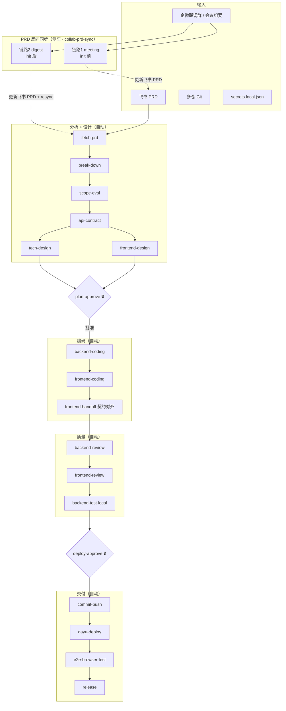
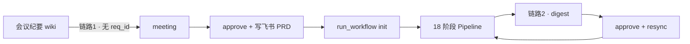
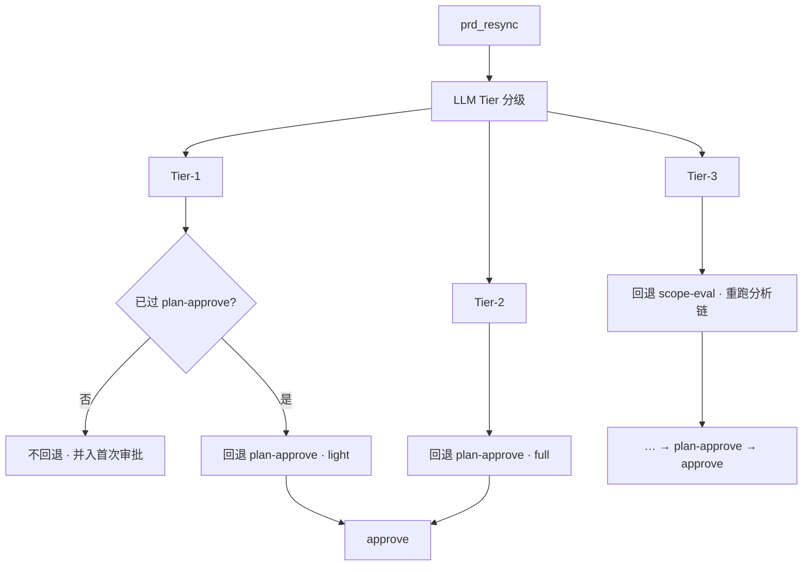

# 门店积分团队 Agentic Coding 全栈改造汇报（v0.6）

**团队**：门店积分研发组

**时间**：2026 年 6 月

**范围**：shop_points_dev_skills Harness 工具集 + req-to-dev Pipeline + collab-prd-sync PRD 反向同步

**上一版汇报**：[门店积分Agentic-Coding全栈改造汇报-v0.4.md](./门店积分Agentic-Coding全栈改造汇报-v0.4.md)（16 阶段全栈 Pipeline）

**本版定位**：在 v0.4 全栈交付能力之上，新增 **PRD 反向同步（会议纪要 / 联调群）**，并将 Pipeline 升级为 **协议先行 + 详设并行** 的 18 阶段模型。

---

## 一、与 v0.4 的核心差异（总览）

| 维度 | v0.4 | v0.6 |
|------|------|------|
| **Pipeline 阶段** | 16 阶段 | **18 阶段** |
| **分析 / 设计链** | fetch → break-down → scope-eval → **tech-design** → plan-approve | 增加 **api-contract**、**frontend-design**；tech-design 仅后端详设 |
| **前后端协作模型** | **后端 → FDH → 前端**（实现即契约） | **协议 → 详设并行 → 审批冻结 → 编码 → 契约对齐** |
| **plan-approve 审什么** | spec + impact + **tech-design** | spec + impact + **api-contract** + **tech-design** + **frontend-design** |
| **FDH / frontend-handoff** | 前端唯一输入；从后端 diff **生成** API 契约 | 更名为 **契约对齐**；对照已审批契约与代码产出 **verify 报告** |
| **PRD 反向更新** | ❌ 无 | ✅ **collab-prd-sync**（会议纪要 + 联调群） |
| **联调 digest 智能化** | — | LLM 摘要（Deepseek-V4-Pro）+ 图片视觉（MiniMax-M3）+ sender 角色映射 |
| **impact 元数据** | `frontend_scope` 等 | 新增 **`api_change`**（none / extend / new） |
| **skills.json 版本** | 0.4.0 | **0.6.0** |
| **Playbooks** | 13 个 | **15 个**（+api-contract、+frontend-design） |

**v0.4 保留且未削弱的能力**：双审批（plan-approve + deploy-approve）、多仓 Git、大禹部署、AgentBrowser E2E、`frontend_scope: none` 条件跳过、Guardrails / Knowledge / Playbooks 分阶段加载。

---

## 二、版本演进：v0.4 → v0.6

### 2.1 Pipeline 流程对比

```mermaid
flowchart TB
  subgraph v04["v0.4 · 16 阶段"]
    A1[分析 4 步含 tech-design] --> A2{plan-approve}
    A2 --> A3[backend-coding]
    A3 --> A4[frontend-handoff FDH]
    A4 --> A5[frontend-coding]
    A5 --> A6[review + test]
    A6 --> A7{deploy-approve}
    A7 --> A8[部署 + E2E + release]
  end

  subgraph v06["v0.6 · 18 阶段"]
    B0[PRD 反向同步侧车] -.->|可选| B1[分析]
    B1[scope-eval] --> B2[api-contract]
    B2 --> B3[tech-design]
    B2 --> B4[frontend-design]
    B3 --> B5{plan-approve}
    B4 --> B5
    B5 --> B6[backend-coding]
    B6 --> B7[frontend-coding]
    B7 --> B8[契约对齐 verify]
    B8 --> B9[review + test]
    B9 --> B10{deploy-approve}
    B10 --> B11[部署 + E2E + release]
  end
```



### 2.2 编码链差异（重点）

| 环节 | v0.4 | v0.6 | 差异说明 |
|------|------|------|----------|
| API 契约何时定 | 后端编码后，FDH 从 **代码反推** | **api-contract 阶段**先出草案，plan-approve **冻结** | 回归行业常见的 **Contract-First** |
| 前端何时开工 | 必须等 **整个 backend-coding + FDH** | plan-approve 后即可按契约 + frontend-design（mock 先行） | 缩短等待；编码顺序仍为 backend → frontend → verify |
| frontend-handoff | 「前端交接」：发明契约 + UI 清单 | 「契约对齐」：`contract-verify-report.md` + 瘦身 FDH | 职责从 **创造** 变为 **校验** |
| 纯 UI、无 API 变更 | 仍走后端先行 FDH | `api_change: none` 跳过 api-contract | 路径更短 |

### 2.3 v0.6 完整 Pipeline（18 阶段）



**阶段清单**

| # | ID | 名称 | v0.4 有？ |
|---|-----|------|-----------|
| 1–3 | fetch-prd / break-down / scope-eval | 同 v0.4 | ✅ |
| 4 | **api-contract** | API 协议规范 | ❌ 新增 |
| 5 | tech-design | 后端技术方案（职责收窄） | ✅ 调整 |
| 6 | **frontend-design** | 前端技术设计 | ❌ 新增 |
| 7 | plan-approve | 人工审批（审批包扩大） | ✅ 增强 |
| 8–18 | 编码 → release | 顺序调整见上表 | ✅ 部分调整 |

---

## 三、新增能力：PRD 反向同步（v0.4 无 → v0.6 有）

v0.6 通过 **collab-prd-sync** Skill，支持从「会议 / 联调」回流更新飞书 PRD，并与 Pipeline 衔接。

### 3.1 两条链路



| 链路 | 触发场景 | 命令 | req_id | 写飞书时机 |
|------|----------|------|--------|------------|
| **链路 1** | 评审会纪要定稿 PRD | `meeting` → 对话确认 → `approve` | ❌ 不需要 | 用户确认后 |
| **链路 2** | 联调群共识写回 PRD | `digest` → 对话确认 → `approve` | ✅ 必须 | 用户确认后 + **自动 prd resync** |

**硬规则（与 v0.4 最大区别之一）**

- digest / meeting **只做 dry-run 预览**，未经用户在对话中确认 **禁止 approve**
- 链路 2 approve 成功后自动回灌本地 `spec.md` / `tasks.md`

### 3.2 联调 digest 增强（v0.6）

| 能力 | 说明 |
|------|------|
| **LLM 文本摘要** | `Deepseek-V4-Pro`（`openapi-ait.ke.com`）凝练共识 + 对照 PRD 拟 `str_replace` |
| **sender 角色** | 系统号 → RD / FE / PM / RD负责人 / RDLeader，摘要按角色加权 |
| **image 消息** | `md5sum` → wekehome `getFileMd5` → 下载 → **MiniMax-M3** 视觉描述 |
| **审批** | Agent 对话确认语：`确认 patch-NNN <nonce> approver <姓名>` |

### 3.3 PRD 变更与 Pipeline 协同

联调 **链路 2** 在 `approve` 成功后自动执行 `prd_resync.py`：refetch 飞书 PRD、增量更新本地产物，并按 **LLM 语义分级（Tier）** 决定是否 **强制回退 Pipeline `current_stage`**。

#### 3.3.1 Tier 如何判定

| 项 | 说明 |
|----|------|
| **实现** | `lib/prd_tier.py` → `chat_completion_json`（与 digest/meeting 共用 LLM 网关） |
| **输入** | PRD unified diff + `plan.json` + `approval_note` + 当前 stage + `impact` 摘录 |
| **产物** | `collaboration/patch-NNN/tier_analysis.json`（tier / 摘要 / 理由 / 建议动作） |
| **非关键词** | 已移除旧版 PRD diff 关键词规则 |

| Tier | 语义（LLM） | 典型示例 |
|------|-------------|----------|
| **1** | 轻量变更，不动对外 API / 范围 | 空态文案、样式、提示语 |
| **2** | 契约或业务规则变更，范围不变 | 新字段、错误码、校验规则 |
| **3** | 范围扩大 | 新页面、新服务、新部署模块 |

#### 3.3.2 resync 更新哪些产物

| Tier | 自动更新文件 | state 标记 |
|------|--------------|------------|
| **1** | `prd.md` + `spec.md` + `tasks.md` | 若回退：`needs_collab_reapprove=true`（轻量） |
| **2** | 同上 | `handoff_stale=true` + `needs_collab_reapprove=true` |
| **3** | 同上 + `impact.md` 附录（LLM 摘要与建议） | 同上 + 回退至 `scope-eval` |

标记写入 `pipeline_state.json` → `prd_resync.delta`；回退详情在 `prd_resync.regression`。

#### 3.3.3 Tier → Pipeline 回退与审批（强制策略）

实现：`lib/pipeline_regress.py` 在 resync 时**修改 `current_stage`**（不再只是软提示）。

| Tier | 回退条件 | 回退目标 | `reapprove_mode` | 人工审批 |
|------|----------|----------|------------------|----------|
| **1** | 当前 **已过** `plan-approve`（含 E2E / release 后） | `plan-approve` | **`light`** | 仅审 **改造点 / UI·E2E**，不重审 API 协议与详设 |
| **1** | 当前 **尚未** 过 `plan-approve` | 不回退 | — | 变更并入首次 plan-approve 审批包 |
| **2** | 已过 `plan-approve` | `plan-approve` | **`full`** | 审 **api-contract + 双端详设 + spec/impact** |
| **3** | 已过 `scope-eval` | `scope-eval` | **`full`** | 重跑 scope-eval → api-contract → 详设 → plan-approve |

回退时：目标 stage 及其 **之后所有 stage** 重置为 `pending`；目标 stage 置为 `running`（`plan-approve` 为 **blocking**）。

`run_workflow approve` 在 plan-approve 通过后清除 `handoff_stale` / `needs_collab_reapprove` / `awaiting_plan_approve`。

#### 3.3.4 举例：E2E 后 Tier-1 改空态文案

```
e2e-browser-test 进行中/已完成
    ↓ 联调 approve + prd_resync（Tier-1）
current_stage → plan-approve（light，blocking）
plan-approve … release 全部 pending
    ↓ PM 确认改造点（不看 api-contract）
run_workflow approve
    ↓
backend-coding（通常无改动）→ frontend-coding（改文案）
→ 契约对齐（更新 FDH §UI/§E2E）→ review → … → E2E 复测 → release
```

#### 3.3.5 举例：编码中 Tier-2 加接口字段

```
backend-coding 进行中
    ↓ prd_resync（Tier-2）
current_stage → plan-approve（full，blocking）
    ↓ 更新 api-contract.yaml / 详设
run_workflow approve
    ↓
重新 backend-coding → frontend-coding → 契约对齐 → …
```

#### 3.3.6 举例：Tier-3 新增 PC 页面

```
frontend-coding 进行中
    ↓ prd_resync（Tier-3）
current_stage → scope-eval
    ↓ 重跑 impact / api-contract / 详设
advance → plan-approve → approve → 编码链 …
```

#### 3.3.7 与首次 plan-approve 的区别

| 场景 | 审批包 |
|------|--------|
| **首次** plan-approve | spec + impact + api-contract + tech-design + frontend-design |
| **联调轻量重审**（Tier-1 · `light`） | spec 联调章节 + tasks 回灌 + tier_analysis + FDH §UI/§E2E |
| **联调全量重审**（Tier-2 · `full`） | 同首次，且须根据 PRD delta 更新契约/详设后再批 |



---

## 四、plan-approve 审批包对比

| 审批物 | v0.4 | v0.6 |
|--------|------|------|
| request/spec.md | ✅ | ✅ |
| impact/impact.md | ✅ | ✅（含 **api_change**） |
| tech-design/tech-design.md | ✅ 含前后端混合理解 | ✅ **仅后端详设** |
| handoff/api-contract.yaml | ❌（FDH 阶段才出） | ✅ **协议草案，审批后冻结** |
| tech-design/frontend-design.md | ❌ | ✅（`frontend_scope ≠ none`） |

驳回后重跑路径：

- **v0.4**：scope-eval → tech-design → plan-approve
- **v0.6**：scope-eval → **api-contract** → tech-design → **frontend-design** → plan-approve

---

## 五、条件跳过（impact frontmatter）

| 字段 | 取值 | v0.4 | v0.6 影响 |
|------|------|------|-----------|
| `frontend_scope` | none / partial / full | 跳过前端链 | 同左 + 跳过 **frontend-design** |
| **`api_change`** | none / extend / new | ❌ 无此字段 | **none** 跳过 **api-contract** |
| `mall_scope` | … | 部署 lottery | 同 v0.4 |
| `deploy_modules` | … | 大禹顺序 | 同 v0.4 |

---

## 六、交付物与配置（相对 v0.4 增量）

### 6.1 新增 / 重要 Playbooks

| Playbook | 阶段 | v0.4 |
|----------|------|------|
| api-contract.md | api-contract | ❌ |
| frontend-design.md | frontend-design | ❌ |
| collab-prd-sync（Skill） | 侧车 | ❌ |

### 6.2 新增模板与脚本

| 路径 | 作用 |
|------|------|
| `references/api-contract-template.yaml` | API 协议草案模板 |
| `references/frontend-design-template.md` | 前端详设模板 |
| `scripts/lib/llm_client.py` | OpenAI 兼容网关（文本 + 视觉） |
| `scripts/lib/chatarchive_client.py` | 联调图片 md5 → signUrl |
| `scripts/lib/sender_roles.py` | 群消息角色映射 |
| `scripts/lib/collab_message_enricher.py` | 图片下载 + 视觉描述 |
| `sub_skills/collab-prd-sync/` | meeting / digest / approve / resync 统一入口 |

### 6.3 LLM 配置（secrets.local.json）

```json
"llm": {
  "base_url": "https://openapi-ait.ke.com/v1",
  "api_key": "<网关 Key>",
  "model": "Deepseek-V4-Pro",
  "vision_model": "MiniMax-M3"
},
"collab": {
  "sender_roles": { "...": "RD|FE|PM|..." },
  "chatarchive": { "secret": "<会话存档密钥>" }
}
```

---

## 七、典型场景走查

### 7.1 全栈新需求（v0.6）

1. （可选）会议纪要 `meeting` → approve 定稿 PRD  
2. `run_workflow init` → fetch-prd … → scope-eval  
3. **api-contract** → **tech-design** + **frontend-design**  
4. **plan-approve** 审协议 + 双端详设  
5. backend-coding → frontend-coding → **契约对齐**  
6. review → deploy-approve → 大禹 + E2E  

### 7.2 联调中发现 PRD 与实现不一致（v0.4 无法闭环 → v0.6 可）

1. 联调群 `/init` 绑定 req_id  
2. 「整理联调消息写回 PRD」→ `digest`（含图片视觉）  
3. Agent 展示共识 + PRD 差异 → 用户对话确认  
4. `approve` 写飞书 → **自动 resync** → 继续编码 / 补契约  

### 7.3 纯后端需求

`frontend_scope: none` + `api_change: none` → 跳过 api-contract（可选）、frontend-design、前端编码链，路径与 v0.4 纯后端类似但更短。

---

## 八、与 v0.4 衔接结论

| v0.4 结论（仍然成立） | v0.6 演进 |
|----------------------|-----------|
| req-to-dev 是流程入口 | ✅ 不变 |
| Guardrails / Knowledge / Playbooks 分阶段加载 | ✅ 不变 |
| deploy-approve 守住交付边界 | ✅ 不变 |
| FDH 解决「前端不知 API」 | ⚠️ **升级为契约先行 + verify**；FDH 不再承担「发明 API」 |
| 16 阶段全栈 Pipeline | ➡️ **18 阶段** + **PRD 反向同步侧车** |

**v0.6 一句话**：在 v0.4「能全栈交付」的基础上，补上 **「会议 / 联调 → PRD」闭环**，并把前后端协作从 **「后端落地再交接」** 改为 **「先协议、详设并行、审批冻结、编码对齐」**。

---

## 九、参考文档

| 文档 | 路径 |
|------|------|
| Pipeline 定义 | `runtime/pipeline.md` |
| req-to-dev 执行指令 | `skills/req-to-dev/SKILL.md` |
| PRD 反向同步 | `skills/req-to-dev/sub_skills/collab-prd-sync/SKILL.md` |
| 联调协作方案 | `docs/联调协作方案.md` |
| v0.4 汇报 | `docs/门店积分Agentic-Coding全栈改造汇报-v0.4.md` |
