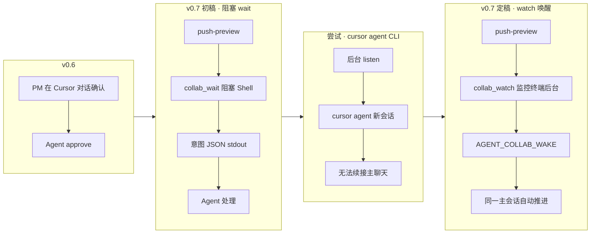
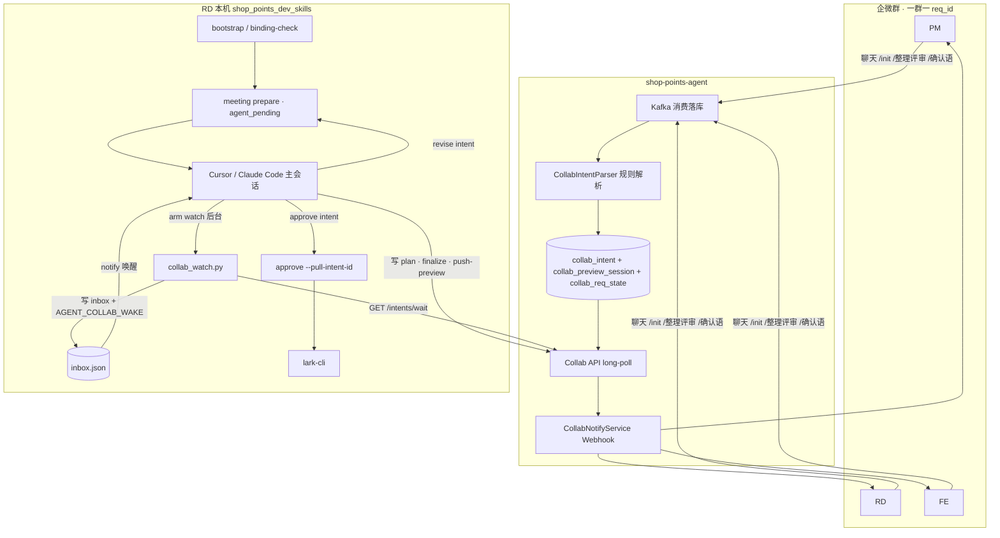
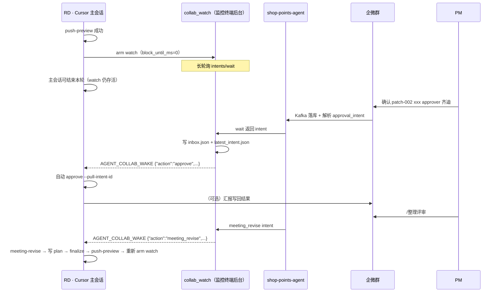
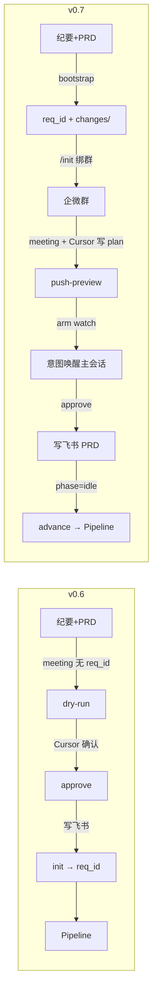
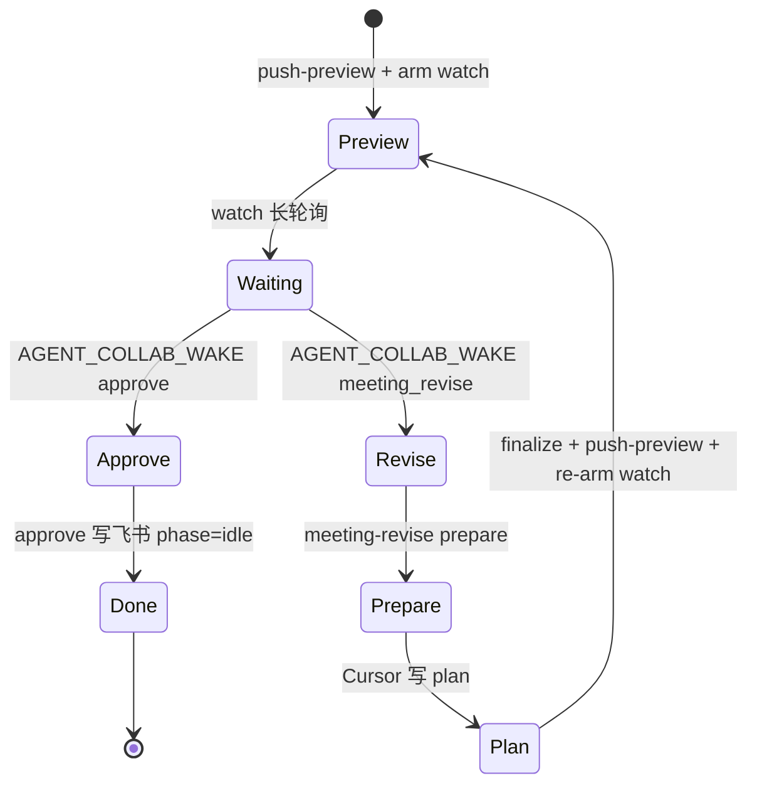
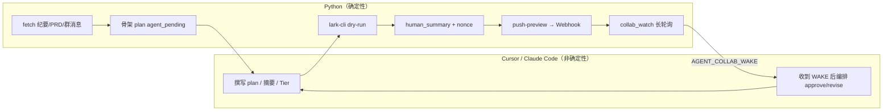
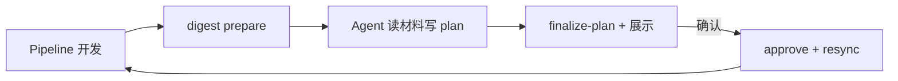

# 门店积分团队 Agentic Coding 全栈改造汇报（v0.7）

**团队**：门店积分研发组

**时间**：2026 年 7 月

**范围**：shop_points_dev_skills Harness + shop-points-agent 协作层 + collab-prd-sync 链路 1 多人通信

**上一版汇报**：[门店积分Agentic-Coding全栈改造汇报-v0.6.md](./门店积分Agentic-Coding全栈改造汇报-v0.6.md)（18 阶段 Pipeline + PRD 反向同步）

**本版定位**：在 v0.6「会议 / 联调 → PRD」能力之上，完成 **链路 1 多人协作通信重构**——企微群成为 PM/RD/FE 主交互面，**Cursor / Claude Code 主会话**成为认知与编排中枢；Harness 脚本退化为 **prepare + 状态机 + 写回执行器**；Agent 服务端提供 **意图邮箱 + Webhook 出站**。

**拍板方案详稿**：[链路1-评审纪要PRD改造方案.md](./链路1-评审纪要PRD改造方案.md)

---

## 一、与 v0.6 的核心差异（总览）

| 维度 | v0.6 | v0.7 |
|------|------|------|
| **链路 1 立项** | `approve` 后 `run_workflow init` 才有 req_id | **`bootstrap` 第一步即生成 req_id** |
| **工作区** | 链路 1 独立 `prd-sync/{token}/` | **统一** `changes/{req_id}/collaboration/` |
| **PM 确认入口** | Cursor 对话 `--chat-confirm` | **企微群** preview + 标准确认语 → **意图队列** |
| **Cursor 驱动方式** | 每步等用户下轮对话 | **`collab_watch` + `AGENT_COLLAB_WAKE` 唤醒主会话自动推进** |
| **认知层** | Python 调内网 LLM（Deepseek / MiniMax） | **Cursor / Claude Code** 读 prompt 写 plan；`plan_source=agent_pending` |
| **企微绑群** | 链路 1 评审期无法 `/init` | **一群一 req_id**，覆盖评审 + 联调全周期 |
| **preview 下发** | 无 | `push-preview` → Agent Webhook → 企微 Markdown + 验证码 |
| **approve 主路径** | `--chat-confirm` | **`--pull-intent-id`**（消费 Agent 意图） |
| **修订轮** | 无标准流程 | 企微 `/整理评审` → `meeting_revise` intent |
| **链路 1 结束** | 提示手动 init | `phase=idle` + `push-state`；可选 `auto_advance_after_prd_approve` |
| **collab-prd-sync** | ~0.4.x | **0.5.0** |

**v0.6 保留且未削弱**：18 阶段 Pipeline、协议先行 + 详设并行、plan-approve / deploy-approve、链路 2 digest + Tier resync、Guardrails / Knowledge / Playbooks、lark-cli 写回飞书。

---

## 二、本版重点：多人协作如何驱动 Cursor / Claude Code

### 2.1 角色与交互面

| 角色 | 是否需要本机 Harness | 主交互面 | 典型动作 |
|------|---------------------|----------|----------|
| **RD** | ✅ 需要（Pipeline 操作机） | Cursor / Claude Code + CLI | bootstrap、meeting、push-preview、arm watch |
| **PM** | ❌ 不需要 | **企微群** + 飞书 PRD | 看 preview、发确认语、`/整理评审` |
| **FE** | ❌ 不需要 | **企微群** + 飞书 PRD | 评审讨论、联调共识 |

**核心矛盾（v0.6）**：状态在 `changes/{req_id}/`，人分散在 Cursor / 企微 / 飞书——缺「企微事件 → 本机编排」桥梁。

**v0.7 解法**：Agent 侧 **意图邮箱** + Harness 侧 **主会话 watch 唤醒**，RD 不必在 Cursor 里轮询「有消息吗」，PM 也不必进 Cursor 确认。

### 2.2 驱动模型演进（为何是 watch，不是 wait / 新开会话）

链路 1 通信方案经历三轮迭代，v0.7 拍板如下：



| 方案 | 问题 | v0.7 结论 |
|------|------|-----------|
| Cursor 对话确认 | PM 不用 Cursor；确认与 preview 脱节 | **降级路径**保留 `--chat-confirm` |
| 主会话 **阻塞 `wait`** | Cursor Shell 回合结束即超时；进程被杀 | **禁止**作为主路径 |
| **`cursor agent` 新开会话** | 无法续接当前聊天窗口 | **禁止** |
| **后台 `watch` + 唤醒哨兵** | 监听在监控终端，事件用 `notify_on_output` 唤醒**本对话** | **链路 1 生产主路径** |
| **无头 `listen`** | 可自动 approve，但不唤醒主会话、不处理修订智能 | **Cursor 离线降级** |

### 2.3 定稿架构：意图邮箱 + 主会话 Watch



**设计要点**

- **发布（Publish）**：Agent 解析群消息后写入 `collab_intent`（单消费者邮箱，非群广播）
- **订阅（Subscribe）**：本机 `collab_watch.py` 长轮询 `GET /api/v1/collab/intents/wait`
- **唤醒（Wake）**：意图到达 → 写 `collaboration/inbox.json` → stdout 输出 `AGENT_COLLAB_WAKE {json}` → Cursor **监控终端** `notify_on_output` 唤醒**同一主会话**
- **执行（Act）**：主会话 Agent 读 inbox，自动 `approve` 或 `meeting-revise` 全流程，**无需用户再输入**
- **写 PRD**：仅本机 `approve` + lark-cli（Agent 服务端不能代跑 lark-cli）

---

## 三、主会话 Watch 机制（v0.7 核心）

### 3.1 时序



### 3.2 落盘文件

```text
changes/{req_id}/collaboration/
├── watch.pid              # watch 进程
├── watch.log
├── watch_state.json       # 已唤醒 intent_id 去重
├── inbox.json             # 最近一次待处理意图（唤醒载荷）
├── latest_intent.json     # 与 inbox 同步
├── listener.pid           # 仅 headless-listen 降级时
└── patch-NNN/
    ├── meeting_prompt.md / revise_prompt.md
    ├── plan.json
    └── human_summary.md
```

### 3.3 唤醒后 Agent 固定动作

| `inbox.action` | 主会话自动执行 | 完成后 |
|----------------|----------------|--------|
| `approve` | `approve --req-id … --pull-intent-id <id>` | 汇报写回；`phase=idle` |
| `meeting_revise` | `meeting-revise` → 读 `revise_prompt.md` 写 `plan.json` → `finalize-plan` → `push-preview` | **重新 arm watch** |

### 3.4 硬规则（Skill + Cursor Rule）

| 规则 | 原因 |
|------|------|
| `push-preview` 后 **必须** arm `watch` | 否则企微确认无人消费 |
| watch 须在 **Cursor 监控终端** 后台运行 | detached daemon 无法 `notify` 主会话 |
| **禁止**主会话阻塞 `wait` 多轮 | 撑爆上下文；Shell 超时 |
| **禁止** `cursor agent` 新开会话处理意图 | 无法续接主聊天 |
| 与 PM 沟通 **走企微 Webhook**，不在 Cursor 里催确认 | 角色分工 |
| `binding-check` 通过后才 `meeting` / `push-preview` | 未绑群会硬拒绝 |

### 3.5 降级路径

| 场景 | 方案 |
|------|------|
| Cursor 窗口关闭 / RD 离线 | `push-preview --headless-listen` → 仅自动 **approve**（`collab_listen.py`） |
| 意图已入队但未唤醒 | `recover-intent --emit-wake` → 补打 `AGENT_COLLAB_WAKE` |
| PM 仍在 Cursor 对话确认 | `approve --chat-confirm "<用户原话>"` |
| 合盖离线后上线 | Agent 队列 `pending` 保留；补 `watch` 或 `recover-intent` |

---

## 四、链路 1 全流程（评审纪要 → PRD）

### 4.1 生命周期对比



### 4.2 对用户可见的 7 步

| 步 | 命令 / 动作 | 执行者 |
|----|-------------|--------|
| ① | `collab bootstrap --prd-url … --meeting-url …` | RD · Cursor |
| ② | 建企微群 + `/init {req_id}` | RD · 企微 |
| ③ | 回复「绑群完成」→ `binding-check` | RD · Cursor |
| ④ | `meeting` → Cursor 读 `meeting_prompt.md` 写 `plan.json` → `finalize-plan` | RD · Cursor |
| ⑤ | `push-preview` → 群收到 preview + 验证码 | 脚本 + Agent Webhook |
| ⑥ | **同一主会话 arm `watch`**（监控终端后台） | RD · Cursor |
| ⑦ | 企微确认 / `/整理评审` → **唤醒主会话自动推进** | PM · 企微 → RD · Cursor |

### 4.3 修订轮



修订轮群消息：`GET /messages?since=revision_cursor`；**入库时不打标**，Pull + 时间窗隔离。

---

## 五、认知层上移：脚本 prepare，Agent 兜底

### 5.1 智能分工

| 能力 | v0.6（Python LLM） | v0.7（Cursor / Claude Code） |
|------|-------------------|------------------------------|
| 纪要 vs PRD 差异 | `llm_client.py` | 读 `meeting_prompt.md` + 材料 |
| 联调群摘要 | Deepseek 文本摘要 | 读 `digest_prompt.md` + `messages_raw.md` |
| 图片理解 | MiniMax 视觉 API | Agent **直读** `patch/images/` |
| Tier 分级 | `prd_tier.py` LLM | Agent 写 `tier_analysis.json` 或 `--tier` |
| plan.json | 脚本启发式 / LLM | **`agent_pending`**，Agent 写 `str_replace` |

> v0.7 移除 Python 内网 LLM 网关（`llm_client.py` 已删除）；`secrets.local.json` 不再要求 `llm` 段。

### 5.2 prepare 边界



---

## 六、Harness 改造清单（相对 main）

### 6.1 已合入 main 的增量（`git diff main`）

| 文件 | 变更要点 |
|------|----------|
| `collab_prd_sync.py` | 子命令：bootstrap / binding-check / meeting-revise / push-preview / watch / wait / listen / recover-intent / push-state |
| `agent_client.py` | binding / messages / preview-sessions / notify / intents/wait / consume / push-state |
| `collab_approve.py` | `--pull-intent-id`；链路 1 收尾 `phase=idle`；`auto_advance_after_prd_approve` |
| `collab_common.py` | `ensure_active_binding`；`load_collab_settings`；slug / change 目录工具 |
| `run_workflow.py` | 与 bootstrap / collaboration phase 衔接 |
| `collab-prd-sync/SKILL.md` | 链路 1 七步 + watch 唤醒规则 |
| `AGENTS.md` | 主会话 watch 生产路径 |
| `agent.yaml.example` | `collab.auto_advance_after_prd_approve` |

### 6.2 新增脚本（工作区 · 待合入）

| 命令 | 脚本 | 职责 |
|------|------|------|
| `bootstrap` | `collab_bootstrap.py` | PRD+纪要 → req_id + `changes/` + scope_hint |
| `binding-check` | `collab_binding_check.py` | 校验 `/init` 绑群 |
| `meeting` | `meeting_prepare.py` | fetch + `agent_pending` 骨架 |
| `meeting-revise` | `meeting_revise_prepare.py` | 修订轮群消息 + refetch |
| `push-preview` | `collab_push_preview.py` | preview 注册 + Webhook |
| **`watch`** | **`collab_watch.py`** | **主路径：长轮询 + `AGENT_COLLAB_WAKE`** |
| `wait` | `collab_wait.py` | 单次阻塞拉取（调试 / 补救） |
| `listen` | `collab_listen.py` | 无头降级：仅自动 approve |
| `recover-intent` | `collab_recover_intent.py` | 消费遗留 intent / `--emit-wake` |
| `push-state` | `collab_push_state.py` | 同步 phase 到 Agent |

支撑库：`collab_inbox.py`、`collab_listener.py`、`slug_utils.py`、`collab_repos.py`。

### 6.3 工作区统一

```text
changes/{req_id}/
├── pipeline_state.json
├── request/prd.md
└── collaboration/
    ├── inbox.json / watch.* / latest_intent.json
    └── patch-001/
        ├── meeting.md · prd_snapshot.md
        ├── meeting_prompt.md · revise_prompt.md
        ├── messages_raw.md          # 修订轮
        ├── plan.json · meta.json
        ├── human_summary.md · dry_run.log
        └── approval.json
```

**废弃**：`prd-sync/{token}/` 主路径（`meeting-legacy` 只读兼容）。

---

## 七、shop-points-agent 改造（协作层）

### 7.1 新增数据表

| 表 | 用途 |
|----|------|
| `collab_group_binding` | `/init` 绑群（V001） |
| `collab_preview_session` | patch + nonce 活跃 preview |
| `collab_intent` | 意图队列（pending → consumed） |
| `collab_req_state` | Harness phase 镜像（非消息打标） |

SQL：`docs/sql/V001` ~ `V003`（V003 统一 `id` 自增主键 + `req_id` UNIQUE）。

### 7.2 新增 / 扩展服务

| 模块 | 职责 |
|------|------|
| `CollabIntentParser` | 规则解析 `/整理评审`、确认语正则（**不用 LLM**） |
| `CollabIntentService` | 入队、phase 校验、long-poll wait、consume |
| `CollabPreviewSessionService` | preview 会话与 nonce 校验 |
| `CollabNotifyService` | Webhook Markdown 出站（`collabConfig.webhookUrl`） |
| `CollabApiController` | REST：`bindings` / `messages` / `preview-sessions` / `notify` / `intents/wait` / `intents/{id}/consume` / `push-state` |

### 7.3 群消息 → 意图映射

| 消息模式 | intent_type | action |
|----------|-------------|--------|
| `/整理评审` / `整理评审反馈` | `command_intent` | `meeting_revise` |
| `确认 patch-NNN <nonce> approver <姓名>` | `approval_intent` | `approve` |
| `/init` / `/close` | — | 现有绑群逻辑 |
| 其他 | — | 仅落库 |

**校验**：`meeting_revise` 要求 `phase=prd_review` 且评审未结束；`approve` 要求 active preview 且 nonce/patch 匹配。

**安全简化（v0.7 拍板）**：移除 `apiToken` / `pmAllowedSenders`；内网 Agent API 直连。

### 7.4 Agent API 与 Harness 对应

```mermaid
flowchart LR
  H1[binding-check] -->|GET /bindings/{req_id}| A1[Agent]
  H2[meeting-revise] -->|GET /messages| A1
  H3[push-preview] -->|POST preview-sessions + notify| A1
  H4[collab_watch] -->|GET intents/wait| A1
  H5[approve] -->|POST intents/consume| A1
  H6[push-state] -->|POST push-state| A1
```

---

## 八、链路 2（联调 digest）在 v0.7 的定位

链路 2 **流程骨架不变**（digest → 确认 → approve + resync），认知层与链路 1 **对齐到 Cursor**：

| 项 | v0.7 |
|----|------|
| 摘要 / diff | Agent 读 `digest_prompt.md` |
| 图片 | 下载到本地，Agent 直读 |
| 确认 | 仍支持 `--chat-confirm`；可复用 watch（后续） |
| Tier + resync | Agent 判定 Tier；`pipeline_regress` 强制回退同 v0.6 |



---

## 九、配置

```yaml
# skills/req-to-dev/config/agent.yaml
agent:
  base_url: "http://shop-points-agent.shop-points-test01.ttb.test.ke.com"
  timeout_sec: 30

collab:
  auto_advance_after_prd_approve: false
  sender_roles: { "...": "RD|FE|PM|..." }
  chatarchive: { ... }   # digest 图片
```

```yaml
# shop-points-agent application-test.yml
collabConfig:
  webhookUrl: "https://qyapi.weixin.qq.com/cgi-bin/webhook/send?key=..."
```

---

## 十、典型场景走查

### 10.1 评审会定稿 PRD（v0.7）

1. RD：`bootstrap`（两链接）→ 输出 `req_id` → 建群 `/init` → `binding-check`
2. `meeting` → Cursor 写 plan → `finalize-plan` → `push-preview`（群收 preview）
3. **arm `watch`**（主会话监控终端后台）
4. PM 企微：`确认 patch-001 abc123 approver 周美琪`
5. 主会话唤醒 → `approve --pull-intent-id` → 飞书 PRD 更新 → `phase=idle`
6. RD：`run_workflow advance` 进入 18 阶段 Pipeline

### 10.2 评审中改一版

1. PM 企微：`/整理评审` + 讨论
2. `AGENT_COLLAB_WAKE` → `meeting-revise` → Cursor 重写 plan → 新 preview → **re-arm watch**
3. PM 确认 → approve

### 10.3 联调写回（同 v0.6，认知上移）

`digest` → Agent 写 plan → 展示 → `approve` → 自动 resync + Tier 回退。

---

## 十一、与 v0.6 衔接结论

| v0.6（仍成立） | v0.7 演进 |
|-----------------|-----------|
| 18 阶段 + 协议先行 | ✅ |
| collab-prd-sync 两条链路 | ✅；链路 1 **通信重构** |
| Tier resync | ✅；Tier 在 Agent 侧 |
| 双审批闸门 | ✅ |

| v0.6 做法 | v0.7 替代 |
|-----------|-----------|
| 链路 1 无 req_id、Cursor 对话 approve | bootstrap + **企微意图 + watch 唤醒主会话** |
| Python LLM 做摘要 | **Cursor / Claude Code 认知兜底** |
| `prd-sync/` 双轨 | **统一 `changes/{req_id}/`** |
| meeting 后手动 init | bootstrap 前置 |

**v0.7 一句话**：在 v0.6 交付能力之上，把链路 1 **多人协作通信**从「Cursor 聊天确认」升级为 **「企微群驱动 + Agent 意图邮箱 + 主会话 watch 唤醒自动推进」**；语义智能收敛到 **Cursor / Claude Code**，脚本只做 **prepare、状态同步与写回**。

---

## 十二、参考文档

| 文档 | 路径 |
|------|------|
| 链路 1 拍板方案 | `docs/链路1-评审纪要PRD改造方案.md` |
| collab-prd-sync Skill | `skills/req-to-dev/sub_skills/collab-prd-sync/SKILL.md` |
| Cursor Rule | `.cursor/rules/collab-prd-sync.mdc` |
| Agent 指引 | `AGENTS.md` |
| 联调协作方案 | `docs/联调协作方案.md` |
| v0.6 汇报 | `docs/门店积分Agentic-Coding全栈改造汇报-v0.6.md` |
| Agent SQL | `shop-points-agent/docs/sql/V001~V003` |
| Pipeline | `runtime/pipeline.md` |
