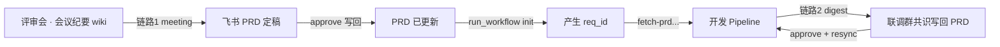

# collab-prd-sync — PRD 反向同步

## 生命周期（重要）



| 阶段 | 有无 req_id | 命令 | 工作区 |
|------|-------------|------|--------|
| **会议纪要 → PRD** | ❌ 尚无 | `meeting` → `approve --prd-url` | `prd-sync/{prd_token}/` |
| **Pipeline 开发** | ✅ init 后 | `run_workflow init` | `changes/{req_id}/` |
| **联调群 → PRD** | ✅ 必须 | `digest` → `approve --req-id` → `resync` | `changes/{req_id}/collaboration/` |

> **会议纪要更新 PRD 发生在 `init` 之前**，不要要求 req_id，不要 resync。

## 审批方式（默认：Agent 聊天交互）

`meeting` / `digest` 完成后，`human_summary` 会给出**验证码**。用户在 **Agent 对话**中回复：

```
确认 patch-001 abc123 approver 周美琪
```

Agent 代跑 approve（`--chat-confirm` 必须为用户原话）：

```bash
python3 .../collab_prd_sync.py approve \
  --prd-url "https://beike.feishu.cn/wiki/yyy" \
  --patch patch-001 \
  --approver 周美琪 \
  --chat-confirm "确认 patch-001 abc123 approver 周美琪"
```

联调阶段将 `--prd-url` 换成 `--req-id`。

可选 `--mode terminal`：本机终端输入 `y`（极少使用）。

## 链路 1：会议纪要 → PRD（pre-pipeline）

用户给出**会议纪要 URL + PRD URL**即可：

```bash
cd <shop_points_dev_skills 根目录>
python3 skills/req-to-dev/sub_skills/collab-prd-sync/scripts/collab_prd_sync.py meeting \
  --meeting-url "https://beike.feishu.cn/wiki/xxx" \
  --prd-url "https://beike.feishu.cn/wiki/yyy"
```

审批写回见上文「Agent 聊天交互」；**无需 req_id**。

PRD 定稿后，RD 才立项：

```bash
python3 skills/req-to-dev/scripts/run_workflow.py init \
  --url "https://beike.feishu.cn/wiki/yyy" \
  --slug <需求名> --target <项目路径>
```

## 链路 2：联调群 → PRD（Pipeline 已 init）

```bash
python3 .../collab_prd_sync.py digest --req-id <req_id> --window 48h
python3 .../collab_prd_sync.py approve --req-id <req_id> --patch patch-001 --approver <pm>
python3 .../collab_prd_sync.py resync --req-id <req_id>
```

## 硬规则

- `meeting` / `digest` 仅 dry-run
- 真实写回必须 `approve` + **用户在对话中的确认语**（`--chat-confirm`）
- Agent 不得伪造确认语；不得未经用户回复就 approve
- 链路 1 **禁止** resync

## Cursor 触发

「根据这份会议纪要更新 PRD」+ 两个链接 → 执行 `meeting`，展示 `prd-sync/.../human_summary.md`，指导 `approve --prd-url`。
