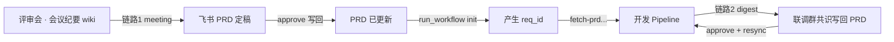

# collab-prd-sync — PRD 反向同步

## 「整理联调消息写回 PRD」是什么意思（必读）

**不是**只拉群消息、**不是** digest 跑完就等于写回 PRD。

完整含义：

1. **拉取**企微联调群已落库消息（Agent API）
2. **凝练摘要**：联调群里定了什么共识（字段、规则、文案、交互…）
3. **对照 PRD**：找出 PRD 与联调共识**有出入**之处
4. **拟修正**：生成 patch 计划 + lark-cli **dry-run 预览**（此时**仍不写飞书**）
5. **人工对话确认**：向 PM/RD 展示摘要 + 拟改 PRD 哪些点 + `human_summary` 验证码 → **必须停在这里等确认**
6. **确认后才写回**：用户在对话中明确确认 → `approve` 才真正更新飞书 PRD
7. **自动 resync**：链路 2 approve 成功后自动回灌本地 spec/tasks（`--skip-resync` 可跳过）

> **写回 PRD 发生在第 6 步，之前一律是预览。Agent 绝不可跳过第 5 步。**

## 生命周期（重要）



| 阶段 | 有无 req_id | 命令 | 工作区 |
|------|-------------|------|--------|
| **会议纪要 → PRD** | ❌ 尚无 | `meeting` → `approve --prd-url` | `prd-sync/{prd_token}/` |
| **Pipeline 开发** | ✅ init 后 | `run_workflow init` | `changes/{req_id}/` |
| **联调群 → PRD** | ✅ 必须 | `digest` → `approve --req-id`（自动 resync） | `changes/{req_id}/collaboration/` |

> **会议纪要更新 PRD 发生在 `init` 之前**，不要要求 req_id，不要 resync。

## 审批方式（默认：Agent 聊天交互）

`meeting` / `digest` 完成后，`human_summary` 会给出**验证码**。用户在 **Agent 对话**中回复：

```
确认 patch-001 abc123 approver 周美琪
```

Agent 代跑 approve（`--chat-confirm` 必须为用户原话；`patch`/`approver` 从确认语解析）：

```bash
python3 .../collab_prd_sync.py approve \
  --req-id "<req_id>" \
  --chat-confirm "确认 patch-001 abc123 approver 周美琪"
```

链路 1（会议纪要）将 `--req-id` 换成 `--prd-url`；链路 1 不 resync。

可选 `--mode terminal`：本机终端输入 `y`（极少使用）。

## 链路 1：会议纪要 → PRD（pre-pipeline）

用户给出**会议纪要 URL + PRD URL**即可：

```bash
cd <shop_points_dev_skills 根目录>
python3 skills/req-to-dev/sub_skills/collab-prd-sync/scripts/collab_prd_sync.py meeting \
  --meeting-url "https://beike.feishu.cn/wiki/xxx" \
  --prd-url "https://beike.feishu.cn/wiki/yyy"
```

审批写回见上文「Agent 聊天交互」；**无需 req_id**。

PRD 定稿后，RD 才立项：

```bash
python3 skills/req-to-dev/scripts/run_workflow.py init \
  --url "https://beike.feishu.cn/wiki/yyy" \
  --slug <需求名> --target <项目路径>
```

## 链路 2：联调群 → PRD（Pipeline 已 init）

`digest` 流程（**不会**把原始群消息 append 到 PRD）：

1. 拉 Agent 联调群消息 → `messages_raw.md`（消息按 **sender 系统号 → 角色** 标注）
2. **image 消息**：用 `md5sum` 调 wekehome `getFileMd5` 换 `signUrl` → 下载到 `patch/images/` → **视觉模型描述**（不再把 md5 JSON 当正文）
3. **AI 摘要**联调共识（`collab_summary.md`；配置 `llm.api_key`，否则启发式）
3. **对照 PRD** 生成 `str_replace` 或结构化共识 append → `plan.json`
4. lark-cli **dry-run** → `dry_run.log`
5. 展示 `human_summary.md` → **等 PM 对话确认** → `approve`

```bash
python3 .../collab_prd_sync.py digest --req-id <req_id> --window 48h
python3 .../collab_prd_sync.py approve --req-id <req_id> --patch patch-001 --approver <pm>
python3 .../collab_prd_sync.py resync --req-id <req_id>
```

LLM 配置（`skills/req-to-dev/config/secrets.local.json`）：

```json
"llm": {
  "api_key": "<网关 Key>",
  "base_url": "https://<内网 OpenAI 兼容网关>/v1",
  "model": "Deepseek-V4-Pro",
  "vision_model": "MiniMax-M3"
}
```

- **文本摘要**（纪要 / 联调）：`model` → `Deepseek-V4-Pro`
- **图片分析**：`vision_model` → `MiniMax-M3`（须支持 `image_url` 多模态）
- `api_key` 可写在 `secrets.local.json`，或环境变量 `OPENAI_API_KEY`（文件中留空 `""` 时读环境变量）
- 无 key 时用启发式（颜色变更、纪要式删除规则等）；图片仅下载、不做视觉描述

**发言角色映射**（digest 摘要时标注 `[RD]` / `[FE]` / `[PM]` 等，可在 `secrets.local.json` → `collab.sender_roles` 覆盖）：

| 系统号 | 角色 | 说明 |
|--------|------|------|
| 31449898 | RD | 后端研发 |
| 31175736 | FE | 前端研发 |
| 29198147 | PM | 产品经理 |
| 26670281 | RD负责人 | 后端负责人 |
| 20233755 | RDLeader | 研发负责人 |

**会话存档图片**（`message_content` 为 `{"md5sum":...}` 的 image 消息）：

1. 配置 `secrets.local.json` → `collab.chatarchive.secret`（及 app_id / biz_code）
2. digest 自动换 `signUrl`、下载图片、用 `llm.vision_model`（`MiniMax-M3`）生成视觉描述
3. 摘要 LLM 读的是「视觉描述 + 文字」，不是 md5
4. `--no-images` 可跳过图片解析

## 硬规则

- `meeting` / `digest` 仅 dry-run
- 真实写回必须 `approve` + **用户在对话中的确认语**（`--chat-confirm`）
- Agent 不得伪造确认语；不得未经用户回复就 approve
- 链路 1 **禁止** resync

## 触发时机（Cursor / Claude Code 必读）

### 「整理联调消息写回 PRD」→ 完整侧车流程（链路 2）

用户说 **整理联调消息写回 PRD** / 整理联调写回 PRD / 联调共识写回 PRD / 企微消息整理 等时，Agent **按顺序**执行，并在**人工确认前停止**：

| 步骤 | Agent 做什么 | 是否写飞书 PRD |
|------|--------------|----------------|
| 1 | `digest --req-id <id>`：拉群消息、fetch PRD、生成 draft patch + dry-run | ❌ |
| 2 | 读 `digest_prompt.md`、`request/prd.md`、`human_summary.md`；向用户说明：**联调共识摘要** + **PRD 拟修正点**（有出入处）；必要时协助修订 `plan.json` 后再 dry-run | ❌ |
| 3 | 请 PM/RD 审阅预览；给出确认语模板：`确认 patch-NNN <nonce> approver <姓名>` | ❌ **必须等待** |
| 4 | 用户**在本轮对话**发出确认语后 → `approve --chat-confirm` → **自动 resync** | ✅ |

缺 `req_id` 先向用户索要；群须已 `/init` 绑定。

### 其他触发

| 用户说法 | 动作 |
|----------|------|
| 根据会议纪要更新 PRD | 链路 1 · `meeting`（无 req_id）→ 同样须对话确认后才 approve |
| 用户已发「确认 patch-NNN … approver …」 | 仅 `approve`（`--chat-confirm` 为用户原话） |
| prd resync | `resync` |

### 步骤 1 命令

```bash
cd <shop_points_dev_skills 根目录>
python3 skills/req-to-dev/sub_skills/collab-prd-sync/scripts/collab_prd_sync.py digest \
  --req-id <req_id> --window 48h
```

### 步骤 2 Agent 必做（digest 脚本之后）

- 打开 `changes/<req_id>/collaboration/patch-NNN/digest_prompt.md`（群消息）与 `request/prd.md`
- 用自然语言向用户呈现：**联调定了什么**、**PRD 哪里不一致**、**拟怎么改**
- 若 `plan.json` 只是机械 append、未体现 PRD 差异，Agent 应修订 `plan.json` 并说明变更，**仍不 approve**

### 步骤 3–4 确认语（写回 + 自动 resync）

用户发送（示例）：

```
确认 patch-002 991337 approver 齐迪
```

Agent **一条命令**即可（`patch`/`approver` 可从确认语解析）：

```bash
python3 .../collab_prd_sync.py approve \
  --req-id <req_id> \
  --chat-confirm "确认 patch-002 991337 approver 齐迪"
```

成功后：**写回飞书 PRD → 自动 prd resync** 回灌 `spec.md` / `tasks.md`。无需再单独跑 resync。

**未收到用户原话确认 → 禁止 approve。**

## Cursor / Claude Code 安装

- **Claude Code**：`ln -sf <本仓库>/skills/req-to-dev/sub_skills/collab-prd-sync ~/.claude/skills/collab-prd-sync`
- **Cursor**：`ln -sf <本仓库>/skills/req-to-dev/sub_skills/collab-prd-sync ~/.cursor/skills/collab-prd-sync`
- 本仓库已含 `.cursor/rules/collab-prd-sync.mdc`（在 **shop_points_dev_skills** 根打开工作区时生效）

## 凭证 / 权限自检（check-config）

`meeting` / `approve` 在执行前会**自动预检**凭证是否缺失、是否有效、5 个权限是否充足。任一项不通过则直接退出，并打印三段诊断报告。

预检覆盖的 5 个权限（缺一不可）：

| 权限 | 探针 |
|------|------|
| `docx:document:write_only` | `lark-cli update --dry-run` |
| `docx:document:readonly` | `GET /docx/v1/documents/{id}/raw_content` |
| `wiki:wiki:readonly` | `GET /wiki/v2/spaces/get_node` |
| `drive:drive:readonly` | `GET /drive/v1/files?limit=1` |
| `im:resource` | `GET /im/v1/files?limit=1` |

**手动调用**（独立诊断）：

```bash
python3 .../collab_prd_sync.py check-config \
  --url "https://beike.feishu.cn/wiki/xxx"
# 输出人类可读三段报告
# --json 输出单行 JSON 供 Agent 解析
# --skip-update-probe 跳过写权限探针
```

**调试绕过**：`meeting` / `approve` 加 `--skip-preflight` 跳过自检（不推荐生产用）。

**Agent 协作模式**：

- 用户首次跑 `meeting` / `approve` 失败时，Agent 自动跑 `check-config --json` 拿到结构化诊断
- 根据 `permissions` 字段逐条提示用户：「请到飞书开放平台开通 X 权限」
- 不修改任何 lark-cli / 凭证配置——自检只诊断不修复
